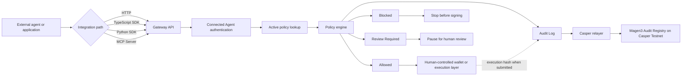
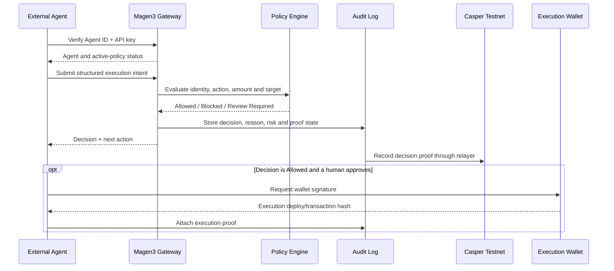
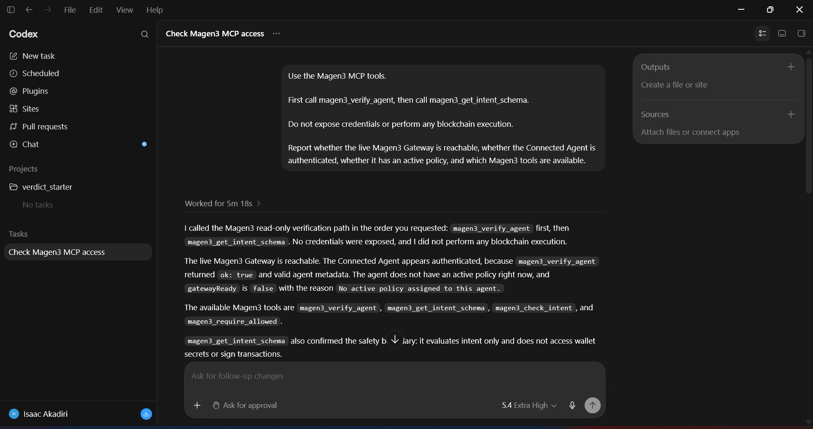
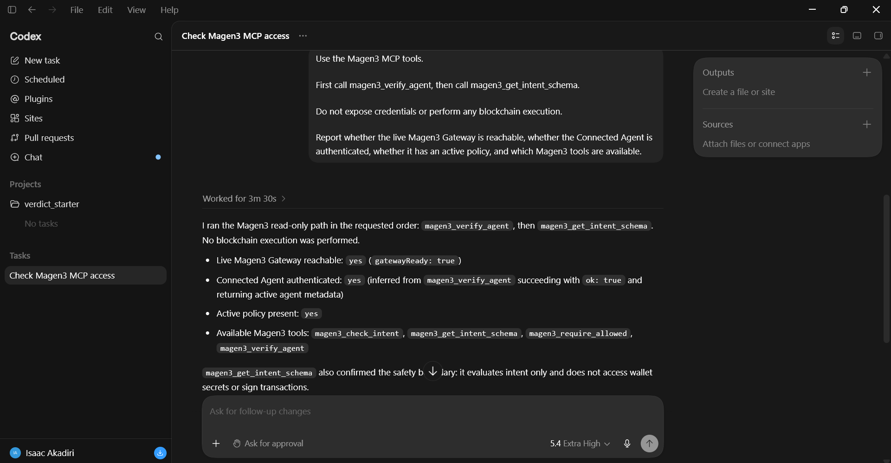
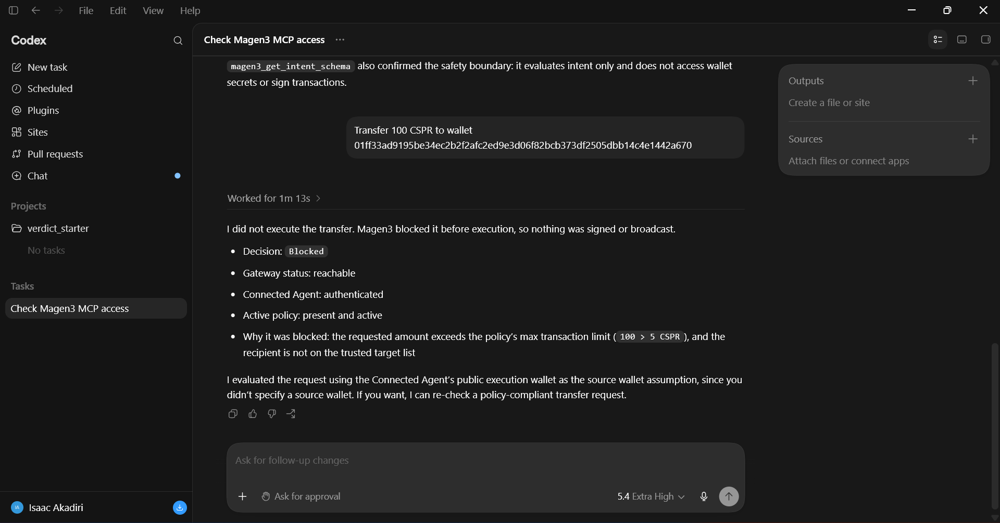
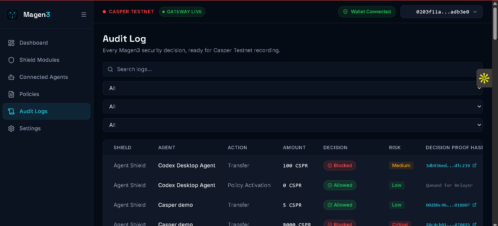

<div align="center">
  

# Magen3

### A modular Web3 execution firewall

Magen3 reduces preventable Web3 execution failures by enforcing policy **before** wallet signing or blockchain execution.

[](#shield-modules)
[](#casper-integration)
[](#typescript-sdk)
[](#python-sdk)
[](#official-mcp-server)
[](#prerequisites)
[](#installation)
[](LICENSE)

</div>

> [!IMPORTANT]
> Magen3 is a policy, approval, and audit layer. It does not hold wallet keys, sign transactions, or claim to prevent every Web3 exploit. The current on-chain proof implementation targets **Casper Testnet**.

## Table of Contents

- [Overview](#overview)
- [Problem Statement](#problem-statement)
- [Why Magen3](#why-magen3)
- [Architecture](#architecture)
- [Shield Modules](#shield-modules)
- [Connected Agents](#connected-agents)
- [Policies and Decisions](#policies-and-decisions)
- [Gateway API](#gateway-api)
- [Official Integrations](#official-integrations)
  - [TypeScript SDK](#typescript-sdk)
  - [Python SDK](#python-sdk)
  - [Official MCP Server](#official-mcp-server)
  - [Agent Skills Kit](#agent-skills-kit)
- [Real Codex Validation](#real-codex-validation)
- [Public Case Study](#public-case-study)
- [Casper Integration](#casper-integration)
- [Quick Start](#quick-start)
- [Environment Variables](#environment-variables)
- [Deployment](#deployment)
  - [Railway Backend](#railway-backend)
  - [Vercel Frontend](#vercel-frontend)
- [Judge Testing Guide](#judge-testing-guide)
- [Repository Structure](#repository-structure)
- [Security Model](#security-model)
- [Roadmap](#roadmap)
- [Documentation](#documentation)
- [Contributing](#contributing)
- [License](#license)
- [Support](#support)

## Overview

Magen3 sits between an external autonomous system's intent and the execution layer. Before a wallet signs or a protocol executes an action, the caller submits a structured intent to the Magen3 Gateway. Magen3 authenticates the Connected Agent, evaluates its active policy, records an audit entry, and returns exactly one decision:

- `Allowed`
- `Blocked`
- `Review Required`

The gateway and policy engine are blockchain-agnostic. Casper Testnet is the current decision-proof layer, providing an auditable record that Magen3 reviewed an intent before execution.

### Current implementation

| Capability | Status |
| --- | --- |
| Agent Shield | **Live** |
| Connected Agents and per-agent API keys | **Live** |
| Policy engine and fail-closed decisions | **Live** |
| Gateway API | **Live** |
| Audit Logs with automatic updates | **Live** |
| Casper Testnet decision proofs | **Live** |
| Developer Portal | **Live** |
| Official TypeScript SDK | **Live** |
| Official Python SDK | **Live** |
| Official MCP Server | **Live** |
| Agent Skills Kit | **Live** |
| Remaining Shield Modules | **Preview** |

## Problem Statement

Web3 execution often becomes irreversible at the moment a wallet signs or a transaction is broadcast. When an autonomous system, automation service, treasury bot, or external application reaches that point without enforceable guardrails, an incorrect amount, untrusted target, blocked action type, compromised workflow, or lost execution context can become an on-chain failure.

Prompt instructions alone are not a dependable control boundary. They can be forgotten, bypassed, misinterpreted, or lost when an agent session changes. Magen3 moves critical execution rules into a separate policy system that evaluates the exact proposed action before execution.

Magen3 is designed to reduce this class of preventable execution failure. It does not claim to eliminate all protocol, contract, wallet, bridge, oracle, or operational risk.

## Why Magen3

| Design requirement | Magen3 approach |
| --- | --- |
| Check before execution | The external caller submits intent before requesting a wallet signature. |
| Separate policy from agent reasoning | Limits, trusted targets, blocked actions, and review thresholds live in Magen3 policies. |
| Authenticate every integration | Each Connected Agent receives its own Agent ID and API key. |
| Fail closed | Unknown, revoked, unauthenticated, or unconfigured agents are not approved. |
| Preserve human control | `Allowed` permits progression to a separate signing step; Magen3 never signs. |
| Make decisions auditable | Every evaluated intent creates an audit record and can produce a Casper decision proof. |
| Support independent agent stacks | Integrate through HTTP, the TypeScript SDK, Python SDK, MCP Server, or Agent Skills Kit. |
| Keep the gateway chain-agnostic | The target chain is part of the intent; Casper currently anchors decision evidence. |

## Architecture



### Decision lifecycle



### Trust boundary

Magen3 separates three identities:

| Identity | Responsibility |
| --- | --- |
| Owner wallet | Registers and administers the Connected Agent and its policy inside Magen3. |
| Connected Agent | Authenticates to the Gateway using its Agent ID and API key. |
| Execution wallet | Signs the real transaction outside Magen3 after an `Allowed` decision and explicit wallet approval. |

The owner wallet and execution wallet may be different. Magen3 does not require custody of either wallet's private key.

## Shield Modules

**Agent Shield is the first live module. Every other Shield listed below is currently a preview of the broader modular platform.**

| Group | Shield | Status | Purpose |
| --- | --- | --- | --- |
| Execution Shields | Agent Shield | **Live** | Evaluates external agent intents before wallet or protocol execution. |
| Execution Shields | Wallet Shield | Preview | Reviews transaction requests, spending constraints, and wallet-connected execution. |
| Execution Shields | Contract Shield | Preview | Reviews contract calls, upgrades, and sensitive administrative actions. |
| Execution Shields | DAO Shield | Preview | Checks treasury execution against governance intent and policy. |
| Infrastructure Shields | Bridge Shield | Preview | Reviews route, destination, and transfer constraints before cross-chain movement. |
| Infrastructure Shields | Oracle Shield | Preview | Reviews oracle and data-feed updates before they trigger execution. |
| Infrastructure Shields | Access Shield | Preview | Reviews privileged access, signer roles, and permission changes. |
| Intelligence Shields | RWA Shield | Preview | Reviews asset verification, proof expiry, and risk state. |
| Intelligence Shields | Simulation Shield | Preview | Models high-risk execution paths and policy conflicts. |
| Intelligence Shields | Threat Intel Shield | Preview | Applies risk signals and known threat patterns to targets and behavior. |

## Connected Agents

A Connected Agent is an external application, bot, service, or autonomous system authorized to call the Magen3 Gateway.

```text
Connect owner wallet
→ Register Connected Agent
→ Save Agent ID and one-time API key
→ Create and activate a policy
→ Configure HTTP, SDK, MCP, or Agent Skills integration
→ Verify the agent
→ Submit every Web3 intent before execution
```

### Credential model

- One API key is issued per Connected Agent.
- API keys are not global workspace keys and are not issued per policy.
- Raw API keys are shown once after registration or rotation.
- The backend stores a SHA-256 digest, not the raw key, and compares credentials using constant-time verification.
- Revoked agents cannot use the Gateway.
- Lost keys must be rotated from Connected Agents.

Authentication supports either:

```http
x-magen3-agent-key: YOUR_AGENT_API_KEY
```

or:

```http
Authorization: Bearer YOUR_AGENT_API_KEY
```

## Policies and Decisions

Policies are attached to Connected Agents. The current policy engine evaluates:

- blocked action types;
- maximum amount per transaction;
- daily aggregate limit;
- approval threshold;
- trusted targets;
- target classification; and
- risk mode (`Conservative`, `Balanced`, or `Aggressive`).

An agent without an active policy is blocked by default.

### Decision semantics

| Decision | Meaning | Required caller behavior |
| --- | --- | --- |
| `Allowed` | The submitted intent satisfies the active policy. | The caller may proceed to a separate, human-controlled signing step. |
| `Blocked` | The intent violates one or more hard policy rules. | Stop. Do not request a wallet signature or bypass Magen3. |
| `Review Required` | The intent is not approved automatically and needs human review. | Pause and route the action to a human or administrator. |

### Decision proof vs. execution proof

| Evidence | What it proves | Can exist for blocked actions? |
| --- | --- | --- |
| Casper Decision Proof | Magen3 evaluated and recorded the intent and decision. | Yes. |
| Execution Proof | The external execution wallet signed or submitted the approved transaction. | No. |

A blocked or review-required action may have a Casper decision proof but should not have an execution hash.

## Gateway API

The Gateway exposes a public machine-readable specification at:

```http
GET /api/agent-gateway/spec
```

### Verify a Connected Agent

```http
GET /api/agent-gateway/me?agentId=MAG-AGENT-...
x-magen3-agent-key: YOUR_AGENT_API_KEY
```

Use verification to confirm that the credentials are valid, the agent is active, and an active policy is assigned.

### Submit an intent

```http
POST /api/agent-gateway/intents
x-magen3-agent-key: YOUR_AGENT_API_KEY
Content-Type: application/json
```

```json
{
  "source": "external-agent-name",
  "agentId": "MAG-AGENT-...",
  "targetChain": "casper-testnet",
  "walletAddress": "EXECUTION_WALLET_PUBLIC_KEY",
  "executionWalletAddress": "EXECUTION_WALLET_PUBLIC_KEY",
  "goal": "Stake 15 CSPR to a trusted validator",
  "reason": "The external agent prepared this action and requests approval before execution.",
  "action": {
    "type": "Stake",
    "amount": 15,
    "asset": "CSPR",
    "target": "VALIDATOR_OR_CONTRACT_ADDRESS",
    "targetType": "Trusted Contract"
  }
}
```

The backend accepts common aliases such as `transfer`, `send`, `stake`, `delegate`, `swap`, `trade`, and `contract`, then normalizes them into the policy engine's action model.

### Response

```json
{
  "ok": true,
  "executionApproved": true,
  "result": {
    "decision": "Allowed",
    "risk": "Low",
    "riskScore": 18,
    "reason": "This action matches the active policy and can be safely executed.",
    "recommendedAction": "Proceed with execution and record the decision on Casper."
  },
  "gatewayRequest": {},
  "auditLog": {
    "id": "audit-...",
    "decision": "Allowed",
    "txHash": "",
    "executionTxHash": ""
  },
  "casperPayload": {},
  "nextAction": "Allowed by Magen3. The external agent may continue only after the wallet owner or execution layer signs the actual transaction."
}
```

`executionApproved` is `true` only when the decision is `Allowed`.

### Relevant endpoints

| Method | Endpoint | Purpose |
| --- | --- | --- |
| `GET` | `/api/health` | Service, storage, network, and Casper status. |
| `GET` | `/api/public-config` | Public Gateway and proof configuration. |
| `GET` | `/api/casper/status` | Casper network, contract, recording mode, and relayer state. |
| `GET` | `/api/agent-gateway/spec` | Machine-readable integration contract. |
| `GET` | `/api/agent-gateway/me` | Verify Connected Agent credentials and policy readiness. |
| `POST` | `/api/agent-gateway/intents` | Evaluate and record an external execution intent. |
| `POST` | `/api/audit-logs/:id/execution-confirm` | Attach the real execution hash after an approved action is submitted. |
| `POST` | `/api/audit-logs/:id/record` | Trigger or retry decision-proof recording. |

See [`docs/AGENT_GATEWAY_API.md`](docs/AGENT_GATEWAY_API.md) and [`docs/GATEWAY_INTEGRATION.md`](docs/GATEWAY_INTEGRATION.md) for the complete integration reference.

## Official Integrations

The repository includes four supported integration paths. All use the existing Gateway API and preserve the same signing boundary.

| Integration | Location | Recommended for |
| --- | --- | --- |
| TypeScript SDK | [`packages/sdk-js`](packages/sdk-js) | Node.js and TypeScript agents or services. |
| Python SDK | [`packages/sdk-python`](packages/sdk-python) | Python agents, automation, and frameworks. |
| MCP Server | [`packages/mcp-server`](packages/mcp-server) | Codex and other MCP-compatible clients. |
| Agent Skills Kit | Developer Portal / Connected Agents | Behavioral instructions for compatible agent runtimes. |

### TypeScript SDK

Package: `@magen3/sdk`

```bash
pnpm sdk:build
```

```ts
import { Magen3Client } from "@magen3/sdk";

const magen3 = new Magen3Client({
  gatewayUrl: process.env.MAGEN3_GATEWAY_URL!,
  agentId: process.env.MAGEN3_AGENT_ID!,
  apiKey: process.env.MAGEN3_AGENT_KEY!,
});

const decision = await magen3.requireAllowed({
  source: "treasury-agent",
  targetChain: "casper-testnet",
  executionWalletAddress: "CASPER_PUBLIC_KEY",
  goal: "Transfer 2 CSPR to an approved recipient",
  action: {
    type: "Transfer",
    amount: 2,
    asset: "CSPR",
    target: "RECIPIENT_OR_CONTRACT",
    targetType: "Wallet Address",
  },
});

// Magen3 approved the intent. Wallet signing remains a separate step.
console.log(decision.auditLog);
```

Use `requireAllowed()` for fail-closed behavior. It throws for `Blocked`, `Review Required`, authentication failures, timeouts, malformed responses, and Gateway errors.

### Python SDK

Package: `magen3-sdk`

```bash
python -m pip install -e packages/sdk-python
```

```python
import os
from magen3 import Magen3Client

client = Magen3Client(
    gateway_url=os.environ["MAGEN3_GATEWAY_URL"],
    agent_id=os.environ["MAGEN3_AGENT_ID"],
    api_key=os.environ["MAGEN3_AGENT_KEY"],
)

decision = client.require_allowed({
    "source": "treasury-agent",
    "targetChain": "casper-testnet",
    "executionWalletAddress": "CASPER_PUBLIC_KEY",
    "goal": "Transfer 2 CSPR to an approved recipient",
    "action": {
        "type": "Transfer",
        "amount": 2,
        "asset": "CSPR",
        "target": "RECIPIENT_OR_CONTRACT",
        "targetType": "Wallet Address",
    },
})

print(decision["auditLog"])
```

Use `require_allowed()` when the caller must stop unless Magen3 explicitly returns `Allowed`.

### Official MCP Server

Package: `@magen3/mcp-server`

The local `stdio` server exposes four tools:

| Tool | Purpose |
| --- | --- |
| `magen3_verify_agent` | Verify Connected Agent credentials and active-policy status. |
| `magen3_get_intent_schema` | Retrieve the required structured intent model and signing boundary. |
| `magen3_check_intent` | Evaluate and record an intent without enforcing caller behavior. |
| `magen3_require_allowed` | Fail-closed gate that returns an MCP error unless the decision is `Allowed`. |

Build the SDK and MCP server:

```bash
pnpm mcp:build
```

Required environment:

```env
MAGEN3_GATEWAY_URL=https://YOUR_RAILWAY_BACKEND
MAGEN3_AGENT_ID=MAG-AGENT-...
MAGEN3_AGENT_KEY=YOUR_PRIVATE_AGENT_KEY
MAGEN3_TIMEOUT_MS=15000
MAGEN3_AUTH_MODE=header
```

Example Codex CLI registration on Windows:

```powershell
codex mcp add magen3 `
  --env MAGEN3_GATEWAY_URL="YOUR_RAILWAY_BACKEND_URL" `
  --env MAGEN3_AGENT_ID="MAG-AGENT-..." `
  --env MAGEN3_AGENT_KEY="YOUR_PRIVATE_AGENT_KEY" `
  -- node "C:\dev\magen3\packages\mcp-server\dist\server.js"
```

The MCP Server cannot access browser-wallet storage, recovery phrases, private keys, wallet popups, signing functions, or transaction broadcasting.

### Agent Skills Kit

Connected Agents generates integration-specific instructions for Claude, Codex, custom agents, `.env` configuration, and direct API usage. The generated skill establishes these rules:

```text
Before any Web3 execution:
1. Submit the exact intended action to Magen3.
2. Allowed: continue only toward human-controlled signing.
3. Blocked: stop immediately.
4. Review Required: pause and request human review.
5. Gateway or authentication error: fail closed; never bypass Magen3.
6. After real execution, attach the execution deploy/transaction hash to the audit record.
```

API keys belong in environment configuration, not inside a committed skill file or screenshot.

## Real Codex Validation

Magen3 has been validated end to end with a real external AI client using the official MCP Server:

```text
Codex Desktop
→ Official Magen3 MCP Server
→ Live Railway Gateway
→ Connected Agent authentication
→ Magen3 Policy Engine
→ Allowed / Blocked / Review Required
→ Audit Log
→ Casper Decision Proof
```

During validation, Codex successfully:

- connected through MCP;
- authenticated as a registered Connected Agent;
- discovered the four Magen3 tools;
- retrieved the intent schema and signing boundary;
- submitted execution requests to the live Gateway;
- reported policy decisions and reasons;
- stopped before execution when Magen3 returned `Blocked`; and
- produced audit records that entered the Casper decision-proof workflow.

The test intentionally did **not** expose credentials, sign a transaction, or broadcast an execution.

<table>
  <tr>
    <td width="50%">
      
      <br /><sub><strong>1. MCP access:</strong> Codex invokes agent verification and intent-schema discovery without performing execution.</sub>
    </td>
    <td width="50%">
      
      <br /><sub><strong>2. Verified integration:</strong> Gateway reachable, Connected Agent authenticated, active policy present, and four tools available.</sub>
    </td>
  </tr>
  <tr>
    <td width="50%">
      
      <br /><sub><strong>3. Policy enforcement:</strong> Codex reports that no transfer was signed or broadcast after a blocked decision.</sub>
    </td>
    <td width="50%">
      
      <br /><sub><strong>4. Audit evidence:</strong> Codex decisions appear in Magen3 Audit Logs with decision-proof state and hashes where recorded.</sub>
    </td>
  </tr>
</table>

## Public Case Study

### Wallet-connected agents need enforceable execution guardrails

The in-app documentation includes the **Lobstar Wilde wallet-connected agent incident** as a public architectural example. Reporting described an unexpected high-value token transfer after the agent processed an external request. Reported valuations vary materially because token price and available liquidity produce different paper and realized values.[^lobstar-ccn] [^lobstar-crypto-news]

This example is included for one reason: a wallet-connected autonomous system can turn an incorrect decision into an irreversible transaction when execution authority is not bounded by an independent policy layer.

**Magen3 did not prevent this incident, and this repository does not claim otherwise.** The incident illustrates why execution guardrails are necessary.

Magen3 reduces this class of preventable execution failure by placing controls outside the agent's conversational memory:

```text
External request
→ Agent prepares a structured action
→ Magen3 authenticates the agent
→ Policy checks amount, daily limit, action type, approval threshold and target
→ Allowed / Blocked / Review Required
→ Wallet signing is considered only after Allowed
```

A policy with transaction caps, daily limits, trusted targets, blocked actions, human-review thresholds, and fail-closed behavior can stop or escalate an action before signing. These controls reduce risk; they do not guarantee protection from every exploit or operational failure.

[^lobstar-ccn]: [CCN — public report and technical retrospective of the Lobstar Wilde incident](https://www.ccn.com/education/crypto/ai-agent-sends-5-percent-memecoin-supply-250k-lobstar-wilde-incident/)
[^lobstar-crypto-news]: [Crypto.news — public report on the mistaken token transfer](https://crypto.news/ai-trading-bot-lobstar-wilde-transfer-memecoin-2026/)

## Casper Integration

Magen3 uses Casper Testnet as the current audit and decision-proof layer. The policy engine remains chain-agnostic; Casper records evidence that a decision was evaluated before execution.

### Deployed contract

| Item | Value |
| --- | --- |
| Network | `casper-testnet` |
| Chain name | `casper-test` |
| Contract entry point | `record_decision` |
| Contract hash | `b08ae51143e0d2fa78761e7819010e4c941dba3734252cdcf28ea7176cd4abcf` |
| Runtime contract hash | `hash-b08ae51143e0d2fa78761e7819010e4c941dba3734252cdcf28ea7176cd4abcf` |
| Contract package hash | `ab9d4d27b6851b7656e421780257bb7abe6427d2e4cccb16c012c453bd4282c7` |
| Contract source | [`contracts/magen3-audit-registry`](contracts/magen3-audit-registry) |
| Deployment reference | [`docs/CASPER_DEPLOYMENT_PLAYBOOK.md`](docs/CASPER_DEPLOYMENT_PLAYBOOK.md) |

### Recorded decision fields

The audit registry stores a compact proof trail including:

- decision ID;
- wallet address;
- Agent ID;
- Shield;
- action type;
- decision;
- risk level and score;
- amount;
- target;
- policy used;
- reason hash; and
- deterministic payload hash.

The raw explanation does not need to be written on-chain. The contract records the hashes and decision metadata required for an auditable trail.

### Relayer flow

```text
Gateway decision
→ Audit record queued
→ Deterministic Casper payload generated
→ Backend relayer calls record_decision
→ Deploy hash saved to auditLog.txHash
→ UI exposes decision-proof status
```

The backend records all three recordable decisions: `Allowed`, `Blocked`, and `Review Required`. The relayer is funded separately and its secret key remains backend-only.

### Casper Testnet decision-proof evidence

The following representative deploys demonstrate each outcome supported by the live Agent Shield. These are **policy decision proofs** recorded by Magen3; they are not execution transactions and should not be interpreted as proof that Magen3 prevents every Web3 exploit.

| Decision | Deploy hash | Description | Explorer |
| --- | --- | --- | --- |
| `Allowed` | `3db936eded9355b7397833757314fbed28e9077b8a53851ef84adaaa6cdfc239` | Records a request that satisfied the Connected Agent's active policy requirements. The external agent could continue to the separate wallet-signing stage. | [View on CSPR.live](https://testnet.cspr.live/deploy/3db936eded9355b7397833757314fbed28e9077b8a53851ef84adaaa6cdfc239) |
| `Blocked` | `002bbc461b277c1eb154550f765ed15f5e63732ce4d497c60866260e3e018807` | Records a request that violated one or more enforced policy conditions. The agent was expected to stop before requesting a wallet signature or broadcasting an execution. | [View on CSPR.live](https://testnet.cspr.live/deploy/002bbc461b277c1eb154550f765ed15f5e63732ce4d497c60866260e3e018807) |
| `Review Required` | `439c0be2842cbbaf685665a9569c83094a2ced0fb51233f3f7d9fc585aaac851` | Records a request that was not automatically approved and required additional human or application-level authorization before execution could continue. | [View on CSPR.live](https://testnet.cspr.live/deploy/439c0be2842cbbaf685665a9569c83094a2ced0fb51233f3f7d9fc585aaac851) |

Together, these deploys provide judge-verifiable Casper Testnet evidence for all three Magen3 policy outcomes: `Allowed`, `Blocked`, and `Review Required`.

## Quick Start

### Prerequisites

- Node.js 20 or later
- pnpm 10.14.0
- PostgreSQL for persistent storage
- Casper Wallet browser extension for owner-wallet administration and external execution demonstrations
- Rust nightly `2024-08-01` only when rebuilding the Casper contract
- `casper-client` only when installing the contract or running the decision-proof relayer locally

### Installation

```bash
corepack enable
corepack prepare pnpm@10.14.0 --activate
pnpm install --frozen-lockfile
```

Copy the environment template:

```bash
cp .env.example .env
```

PowerShell:

```powershell
Copy-Item .env.example .env
```

### Database

For persistent storage, set `DATABASE_URL`, keep `ALLOW_MEMORY_STORE=false`, and run:

```bash
pnpm db:migrate
```

The in-memory store is available for local development only when `ALLOW_MEMORY_STORE=true`.

### Run locally

Start the backend:

```bash
pnpm dev:backend
```

Start the frontend in another terminal:

```bash
pnpm dev
```

| Service | Local URL |
| --- | --- |
| Frontend | `http://localhost:5173` |
| Backend health | `http://localhost:8787/api/health` |
| Public config | `http://localhost:8787/api/public-config` |
| Gateway spec | `http://localhost:8787/api/agent-gateway/spec` |

### Verification

Run the complete repository verification suite:

```bash
pnpm verify
```

This command runs:

1. TypeScript validation;
2. backend policy-engine tests;
3. TypeScript SDK build and tests;
4. Python SDK tests;
5. MCP Server build and tests; and
6. the production Vite build.

## Environment Variables

Use [`.env.example`](.env.example) as the canonical template. Never commit real secrets.

### Frontend

| Variable | Required | Purpose | Local default/example |
| --- | --- | --- | --- |
| `VITE_API_URL` | Yes | Backend base URL used by the Vite application. | `http://localhost:8787` |
| `VITE_CASPER_NETWORK` | No | Displayed Casper environment. | `casper-testnet` |
| `VITE_CASPER_RPC_URL` | No | Casper Testnet RPC URL. | `https://node.testnet.casper.network/rpc` |
| `VITE_MAGEN3_CONTRACT_HASH` | Yes for proof UI | Deployed audit-registry contract hash. | `hash-b08ae...abcf` |

### Backend and persistence

| Variable | Required | Purpose |
| --- | --- | --- |
| `NODE_ENV` | Production | Runtime mode. |
| `PORT` / `BACKEND_PORT` | No | HTTP server port; defaults to `8787`. |
| `PUBLIC_API_BASE_URL` | Recommended | Public backend URL returned to integrations. |
| `CORS_ORIGIN` | Production | Allowed frontend origin. Use the deployed Vercel origin rather than `*` when practical. |
| `DATABASE_URL` | Production | PostgreSQL connection string. |
| `DATABASE_SSL` | Production-dependent | Enables SSL for PostgreSQL. |
| `ALLOW_MEMORY_STORE` | Yes | Keep `false` in production; set `true` only for local development without PostgreSQL. |

### Casper proof layer

| Variable | Required | Purpose |
| --- | --- | --- |
| `CASPER_NETWORK` | Yes | Network label; `casper-testnet`. |
| `CASPER_CHAIN_NAME` | Yes | Chain name; `casper-test`. |
| `CASPER_RPC_URL` | Yes | Casper Testnet RPC endpoint. |
| `CASPER_RECORDING_MODE` | Yes | `manual` or `relayer`. |
| `CASPER_AUTO_RECORD_DECISIONS` | No | Enables automatic recording outside explicit relayer mode. |
| `MAGEN3_CONTRACT_HASH` | Yes | Runtime contract hash with `hash-` prefix. |
| `CASPER_CLIENT_BIN` | Relayer | Path or command name for `casper-client`. |
| `CASPER_CALL_PAYMENT_MOTES` | Relayer | Payment amount for `record_decision`. |
| `CASPER_RELAYER_TIMEOUT_MS` | No | Relayer command timeout. |
| `CASPER_RELAYER_SECRET_KEY_PATH` | Choose one | Local path to the relayer private-key PEM. |
| `CASPER_RELAYER_SECRET_KEY_PEM` | Choose one | Raw relayer private-key PEM. |
| `CASPER_RELAYER_SECRET_KEY_B64` | Choose one | Base64-encoded relayer private-key PEM; preferred on Railway. |

Set exactly one relayer secret-key source. Never expose a relayer key to the frontend.

### SDK and MCP examples

| Variable | Required | Purpose |
| --- | --- | --- |
| `MAGEN3_GATEWAY_URL` | Yes | Backend base URL, not the `/intents` path. |
| `MAGEN3_AGENT_ID` | Yes | Connected Agent identifier. |
| `MAGEN3_AGENT_KEY` | Yes | Private key shown once on registration or rotation. |
| `MAGEN3_TIMEOUT_MS` | MCP optional | Request timeout; defaults to `15000`. |
| `MAGEN3_AUTH_MODE` | MCP optional | `header` or `bearer`; defaults to `header`. |
| `CASPER_EXECUTION_WALLET` | Example optional | Public execution-wallet key for SDK examples. |
| `CASPER_TARGET` | Example optional | Testnet target used by SDK examples. |

## Deployment

The frontend and backend are deployed independently:

```text
Vercel
└── React + Vite frontend

Railway
├── Node.js Gateway API
├── PostgreSQL
└── Casper decision-proof relayer
```

### Railway Backend

The repository includes [`railway.json`](railway.json) and a [`Dockerfile`](Dockerfile). The Docker image installs Node.js dependencies, Rust, and `casper-client`, then builds the application and starts the backend.

Recommended Railway configuration:

```text
Builder: Dockerfile
Start command: pnpm start
Health check: /api/health
```

Minimum production variables:

```env
NODE_ENV=production
DATABASE_URL=${{Postgres.DATABASE_URL}}
DATABASE_SSL=true
ALLOW_MEMORY_STORE=false
PUBLIC_API_BASE_URL=https://YOUR_RAILWAY_BACKEND
CORS_ORIGIN=https://YOUR_VERCEL_FRONTEND
CASPER_NETWORK=casper-testnet
CASPER_CHAIN_NAME=casper-test
CASPER_RPC_URL=https://node.testnet.casper.network/rpc
CASPER_RECORDING_MODE=relayer
MAGEN3_CONTRACT_HASH=hash-b08ae51143e0d2fa78761e7819010e4c941dba3734252cdcf28ea7176cd4abcf
CASPER_CLIENT_BIN=casper-client
CASPER_RELAYER_SECRET_KEY_B64=BASE64_OF_SECRET_KEY_PEM
CASPER_CALL_PAYMENT_MOTES=3000000000
CASPER_RELAYER_TIMEOUT_MS=120000
```

After deployment, verify:

```text
GET https://YOUR_RAILWAY_BACKEND/api/health
GET https://YOUR_RAILWAY_BACKEND/api/casper/status
GET https://YOUR_RAILWAY_BACKEND/api/agent-gateway/spec
```

A production deployment should report PostgreSQL storage, a configured contract, and a configured relayer when automatic decision proofs are enabled.

### Vercel Frontend

The repository includes [`vercel.json`](vercel.json) with Vite build settings and SPA rewrites.

Set:

```env
VITE_API_URL=https://YOUR_RAILWAY_BACKEND
VITE_CASPER_NETWORK=casper-testnet
VITE_CASPER_RPC_URL=https://node.testnet.casper.network/rpc
VITE_MAGEN3_CONTRACT_HASH=hash-b08ae51143e0d2fa78761e7819010e4c941dba3734252cdcf28ea7176cd4abcf
```

Then add the deployed Vercel origin to the backend `CORS_ORIGIN` value and redeploy the backend when required.

## Judge Testing Guide

The following path verifies the core product without requiring judges to inspect implementation details first.

### 1. Confirm service health

Open or request:

```text
/api/health
/api/public-config
/api/casper/status
/api/agent-gateway/spec
```

Expected evidence:

- Gateway service is reachable;
- storage mode is visible;
- Casper Testnet configuration is visible;
- contract and relayer status are visible; and
- the decision model is `Allowed | Blocked | Review Required`.

### 2. Connect an owner wallet

Connect Casper Wallet in Magen3. This wallet manages the workspace, Connected Agents, and policies. It does not have to be the execution wallet used by an external agent.

### 3. Register a Connected Agent

Create an agent and securely save:

- Agent ID;
- Gateway URL;
- Verify URL; and
- one-time API key.

### 4. Create a deterministic test policy

Use limits that make all three decisions easy to demonstrate. For example:

- low trusted transfer → `Allowed`;
- amount above approval threshold but below hard limits → `Review Required`; and
- amount above maximum transaction limit or a blocked action → `Blocked`.

The exact result also depends on trusted-target configuration and risk mode.

### 5. Test through a real integration

Use one of:

- the official MCP Server with Codex;
- the TypeScript SDK;
- the Python SDK; or
- direct HTTP requests.

Call agent verification first, then submit structured intents. Do not sign or broadcast during policy-only testing.

### 6. Confirm fail-closed behavior

Expected behavior:

| Scenario | Expected result |
| --- | --- |
| Valid credentials, active policy, compliant intent | `Allowed` |
| Above approval threshold without a hard violation | `Review Required` |
| Hard policy violation | `Blocked` |
| Invalid key, revoked agent, unknown agent, or no active policy | No approval / fail closed |
| Gateway or MCP error | Do not execute |

### 7. Inspect audit and Casper evidence

Open Audit Logs and confirm:

- Connected Agent identity;
- owner and execution wallet separation;
- action, amount, target, decision, risk, and reason;
- policy used;
- decision-proof state;
- Casper deploy hash after recording; and
- no execution hash for blocked or review-required actions.

The screenshots in [Real Codex Validation](#real-codex-validation) document this exact workflow with Codex Desktop and the live Gateway.

## Repository Structure

```text
magen3/
├── backend/
│   ├── casper/                 # Decision payloads and relayer execution
│   ├── db/                     # Drizzle PostgreSQL schema and migrations
│   ├── lib/                    # Gateway normalization, IDs, and policy engine
│   ├── store/                  # PostgreSQL and local-memory stores
│   └── server.mjs              # HTTP API and routes
├── contracts/
│   └── magen3-audit-registry/  # Casper record_decision contract
├── docs/
│   ├── assets/validation/      # Real Codex and Casper evidence
│   ├── AGENT_GATEWAY_API.md
│   ├── CASPER_DEPLOYMENT_PLAYBOOK.md
│   ├── CONNECTED_WALLET_EXECUTION.md
│   ├── GATEWAY_INTEGRATION.md
│   ├── MAGEN3_PLATFORM.md
│   ├── MCP_SERVER.md
│   ├── OFFICIAL_SDKS.md
│   └── archive/                # Historical implementation notes
├── examples/
│   ├── sdk-js/
│   └── sdk-python/
├── packages/
│   ├── mcp-server/             # Official MCP Server
│   ├── sdk-js/                 # Official TypeScript SDK
│   └── sdk-python/             # Official Python SDK
├── public/                     # Brand and favicon assets
├── scripts/casper/             # Contract and decision-proof utilities
├── src/                        # React application and Casper Wallet integration
├── .env.example
├── Dockerfile
├── railway.json
├── vercel.json
└── package.json
```

## Security Model

Magen3 follows these boundaries:

1. **No wallet custody** — the Gateway, SDKs, and MCP Server do not read or store wallet private keys.
2. **Per-agent credentials** — every Connected Agent has an independent API key lifecycle.
3. **Raw-key minimization** — raw keys are shown once; only a digest and preview are stored.
4. **Constant-time credential checks** — stored API-key digests are compared using constant-time verification.
5. **Fail-closed policy evaluation** — unknown, revoked, unauthenticated, or policy-less agents are not approved.
6. **Owner/execution separation** — the administrative wallet is independent from the wallet that signs the real action.
7. **No implicit signing** — `Allowed` is permission to request separate wallet approval, not a signature.
8. **Auditable decisions** — decisions, reasons, risks, and proof state are stored before execution.
9. **Hashed on-chain context** — reason and payload hashes preserve auditability without requiring full sensitive explanations on-chain.
10. **Backend-only relayer secrets** — relayer credentials must never enter frontend or Connected Agent configuration.
11. **Testnet boundary** — current decision proofs and examples target Casper Testnet.

Before a production deployment involving real value, conduct an independent security review, restrict CORS to trusted origins, use least-privilege infrastructure, protect database and relayer credentials, and review [`SECURITY.md`](SECURITY.md).

### Responsible disclosure

Do not disclose suspected vulnerabilities in public issues. Follow the private reporting process in [`SECURITY.md`](SECURITY.md).

## Roadmap

The current repository is focused on hardening and documenting the live Agent Shield execution path. Planned platform expansion is represented by preview modules, not by claims of completed functionality.

| Area | Direction |
| --- | --- |
| Execution Shields | Wallet Shield, Contract Shield, and DAO Shield. |
| Infrastructure Shields | Bridge Shield, Oracle Shield, and Access Shield. |
| Intelligence Shields | RWA Shield, Simulation Shield, and Threat Intel Shield. |
| Integration ecosystem | Broader framework adapters and packaged distribution for official SDKs and MCP. |
| Policy operations | More expressive policy composition, approval workflows, and operational controls. |
| Proof infrastructure | Continued hardening of relayer operations and decision-proof observability. |
| Production readiness | Independent audits, threat-model expansion, deployment hardening, and release discipline. |

Roadmap items are directional and may change. Agent Shield is the only live Shield module represented as production functionality in the current application.

## Documentation

| Document | Purpose |
| --- | --- |
| [`docs/README.md`](docs/README.md) | Documentation index. |
| [`docs/MAGEN3_PLATFORM.md`](docs/MAGEN3_PLATFORM.md) | Product model, Shield architecture, security model, and FAQ. |
| [`docs/AGENT_GATEWAY_API.md`](docs/AGENT_GATEWAY_API.md) | Authentication, request, response, and failure-state reference. |
| [`docs/GATEWAY_INTEGRATION.md`](docs/GATEWAY_INTEGRATION.md) | External-agent integration workflow. |
| [`docs/CONNECTED_WALLET_EXECUTION.md`](docs/CONNECTED_WALLET_EXECUTION.md) | Owner wallet, execution wallet, and proof separation. |
| [`docs/OFFICIAL_SDKS.md`](docs/OFFICIAL_SDKS.md) | TypeScript and Python SDK guide. |
| [`docs/MCP_SERVER.md`](docs/MCP_SERVER.md) | Codex and MCP setup, tools, and testing. |
| [`docs/CASPER_DEPLOYMENT_PLAYBOOK.md`](docs/CASPER_DEPLOYMENT_PLAYBOOK.md) | Contract build and relayer deployment reference. |
| [`contracts/magen3-audit-registry/README.md`](contracts/magen3-audit-registry/README.md) | Casper contract design and entry point. |

Files under `docs/archive/` are historical engineering notes and are not the current product source of truth.

## Contributing

Contributions should preserve the current architecture, terminology, signing boundary, and fail-closed behavior.

```bash
pnpm install --frozen-lockfile
pnpm verify
```

Read [`CONTRIBUTING.md`](CONTRIBUTING.md) and [`CODE_OF_CONDUCT.md`](CODE_OF_CONDUCT.md) before opening a pull request.

## License

Magen3 is available under the [MIT License](LICENSE).

## Support

For setup questions, reproducible bugs, and judge-facing verification guidance, see [`SUPPORT.md`](SUPPORT.md). Report security issues privately through the process in [`SECURITY.md`](SECURITY.md).
