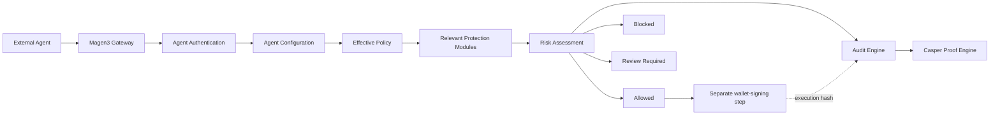

<div align="center">
  

# Magen3

### A modular execution firewall for autonomous blockchain agents

Magen3 protects an agent **before wallet signing or blockchain execution**.

[](#agent-shield)
[](#casper-decision-proofs)
[](#official-integrations)
[](#official-integrations)
[](#official-integrations)
[](LICENSE)

</div>

> [!IMPORTANT]
> Magen3 is a policy, authorization, guidance, audit, and proof layer. It does not hold private keys, approve wallet popups, sign transactions, or guarantee protection from every exploit. The gateway and policy model are chain-agnostic; the current decision-proof implementation uses Casper Testnet.

## Product model

Autonomous agents are gaining the ability to execute swaps, transfers, staking actions, contract calls, and treasury operations. The critical risk is not only what an agent says. It is what the agent is permitted to execute.

Magen3 sits between intent and execution:

```text
External Agent
→ Magen3 Gateway
→ Agent Shield
→ Authenticate Agent
→ Load Agent Configuration
→ Load Effective Policy
→ Run Relevant Protection Checks
→ Risk Assessment
→ Allowed / Blocked / Review Required
→ Audit Log
→ Casper Decision Proof
→ Return Decision to Agent
→ Wallet signing only if Allowed
```

The only final decision states are:

- `Allowed`
- `Blocked`
- `Review Required`

Core authorization is deterministic. A language model is not used to decide whether an action may execute.

## Current implementation status

| Platform component | Status | Current behavior |
| --- | --- | --- |
| Agent Shield | **Live** | Coordinates the complete pre-execution protection flow. |
| Gateway and per-agent authentication | **Live** | Agent ID plus `x-magen3-agent-key` or Bearer token. |
| Execution capabilities | **Live** | Multiple capabilities per agent with backward-compatible legacy mapping. |
| Policy Engine | **Live** | Enforces blocked actions, transaction limits, daily limits, review thresholds, trusted targets, and risk mode. |
| Risk Assessment | **Live** | Combines deterministic findings into one of the three final decisions. |
| Structured findings and guidance | **Live** | Pass, warning, fail, unavailable, or skipped findings with remediation. |
| Audit Engine | **Live** | Stores intent, capabilities, policy, pipeline, findings, decision, reason, proof state, and execution state. |
| Casper Proof Engine | **Live when configured** | Queues and records decision proofs through the existing relayer or manual fallback. |
| Security Coverage | **Live** | Deterministic, explainable configuration-coverage calculation. |
| Integration Health | **Live** | Uses real gateway, credential, policy, request, audit, and proof state. |
| Intent Playground | **Live** | Sends the real current Gateway request format using a registered agent. |
| TypeScript SDK | **Live** | Official `@magen3/sdk` workspace package. |
| Python SDK | **Live** | Official Python client under `packages/sdk-python`. |
| MCP Server | **Live** | Official MCP tools for Codex and compatible runtimes. |

## Agent Shield

Agent Shield is the live centerpiece of Magen3. It is not one small card beside unrelated live products. Protection modules operate under Agent Shield and are evaluated only when relevant to the intent and agent configuration.

### Execution capabilities

An agent may select one or several capabilities:

| Capability | Purpose |
| --- | --- |
| Trading | Swaps, routing, staking, yield actions, and trade execution. |
| Wallet Management | Transfers, destination management, wallet operations, and balance actions. |
| Treasury Operations | DAO or organization funds, high-value actions, and approval-controlled execution. |
| dApp Interactions | Contract calls, DeFi protocols, vaults, staking, borrowing, bridging, and application workflows. |
| Enterprise Automation | Organization workflows, internal permissions, compliance, and controlled automation. |
| Custom | Developer-defined behavior outside the standard categories. |

Convenience packs preselect capabilities but do not lock them:

- Trading Automation Pack
- Treasury Automation Pack
- Enterprise Operations Pack

Legacy agents continue working. When no capability metadata exists, Magen3 maps the existing agent type conservatively; otherwise it falls back to `Custom`.

### Protection modules

| Module | Status | Current implementation |
| --- | --- | --- |
| Identity and Authentication | **Live** | Agent existence, active status, and API-key verification. |
| Policy Enforcement | **Live** | Active-policy lookup and supported deterministic policy fields. |
| Wallet Validation | **Live** | Casper execution-wallet format, wallet destination format/classification, exact self-transfer prevention, approved destinations, transaction and daily limits, and review thresholds. |
| Contract Validation | **Live** | Contract/package identity, target classification, entry points, package-version semantics, network binding, approved contracts, blocked contracts, and optional entry-point allowlists. |
| Execution Simulation | **Preview** | No backend enforcement yet; findings show `unavailable`, never a silent pass. |
| Threat Intelligence | **Preview** | No external threat feed is enforced. |
| Oracle Validation | **Planned** | No current backend checks. |
| Bridge Controls | **Planned** | No current backend checks. |
| Compliance Controls | **Planned** | No current backend checks. |
| Risk Assessment | **Live** | Explainable aggregation of deterministic findings. |

### Live Wallet Validation

Wallet Validation now runs on every authenticated gateway intent before a wallet may be asked to sign. Its deterministic checks include:

- A non-empty Casper execution-wallet public key is required.
- Ed25519 execution keys must use the `01` prefix and valid key length.
- Secp256k1 execution keys must use the `02` prefix and valid key length.
- Wallet-transfer destinations may use a supported Casper public key or `account-hash-...` identifier.
- `Transfer` intents must classify the target as `Wallet Address`.
- Exact source/destination self-transfers are blocked to prevent accidental execution.
- Wallet destinations are checked against the active policy's Trusted Targets list.
- Maximum transaction, daily wallet spending, and human-review thresholds are evaluated as Wallet Validation findings.
- The execution wallet is evaluated independently from the Magen3 owner wallet.

Malformed execution wallets, malformed destinations, incorrect transfer classification, self-transfers, and hard policy-limit violations return `Blocked`. Valid but unapproved destinations return `Blocked` in Conservative mode and `Review Required` in Balanced or Aggressive mode.

Wallet format validation is structural. It does not claim that an address is funded, controlled by the requester, reputable, or safe from every threat. Address reputation remains part of the Threat Intelligence roadmap.

Format reference: [Casper Accounts and Cryptographic Keys](https://docs.casper.network/concepts/accounts-and-keys).

### Live Contract Validation

Contract Validation now runs on every intent that declares a contract-oriented action or contract target. The module deterministically checks:

- Contract-oriented actions use the correct target classification.
- The target is a structurally valid Casper Contract Hash or Contract Package Hash.
- Generic `hash-...` values declare whether they represent a Contract Hash or Package Hash.
- Wallet public keys and account hashes cannot masquerade as contracts.
- Direct contract-call actions include a valid entry-point name.
- Package versions are positive integers when supplied; specific Contract Hash calls do not declare package versions.
- An explicit `chainName` matches the configured Casper network.
- Exact policy blocklist matches always return `Blocked`.
- Exact approved-contract matches can proceed when every other check passes.
- Valid but unapproved contracts return `Blocked` in Conservative mode and `Review Required` in Balanced or Aggressive mode.
- Optional `allowedEntryPoints` policy controls can block unauthorized contract methods.

The `Trusted Contract` label is descriptive only. It never grants trust by itself; the exact contract identifier must match the active policy. Structural validation does not prove that a contract is audited, verified, non-upgradeable, or free of malicious logic. Those deeper checks remain future Contract Validation and Threat Intelligence work.

Format references: [Calling Contracts](https://docs.casper.network/developers/cli/calling-contracts) and [Contract Hash vs. Package Hash](https://docs.casper.network/next/developers/writing-onchain-code/contract-hash-vs-package-hash).

## Guided agent registration

The Connected Agents flow uses a six-step wizard:

1. Agent Details
2. Execution Capabilities
3. Recommended Protection
4. Starter Policy
5. Review
6. Integration Credentials and Quick Start

At least one capability is required. The wizard recommends protection modules and an enforceable starter policy. Existing policies can be used as templates without rebinding the original record.

Raw API keys are shown only after registration or rotation. Magen3 stores the key digest and preview, not the recoverable raw secret.

## Policies

Supported policy fields are enforced by the current backend:

- Maximum transaction amount
- Daily spending limit
- Human-review threshold
- Trusted contracts or destinations
- Blocked contracts through `structuredRules.blockedContracts`
- Optional allowed entry points through `structuredRules.allowedEntryPoints`
- Blocked action types
- Conservative, Balanced, or Aggressive risk mode

Available presets:

- Conservative Trading
- Balanced Trading
- Wallet Safety
- Treasury Safe Mode
- DeFi Automation
- Enterprise Controlled Automation
- Custom

Slippage, state simulation, oracle integrity, bridge intelligence, sanctions screening, and external threat feeds are not represented as live authorization rules.

## Structured findings and decisions

Protection checks emit findings such as:

```json
{
  "module": "Policy Enforcement",
  "status": "fail",
  "severity": "high",
  "rule": "Maximum transaction amount",
  "message": "Requested amount exceeds the active policy limit.",
  "evidence": {
    "received": 60,
    "maximum": 50
  },
  "remediation": "Reduce the amount to 50 CSPR or less, or update the policy if authorized."
}
```

A module can report `pass`, `warning`, `fail`, `unavailable`, or `skipped`. `unavailable` never becomes an implicit pass.

Each decision includes deterministic guidance where available:

- Primary reason
- Relevant policy
- Triggered rule
- Module findings
- Suggested resolution
- Pipeline stages

## Gateway API

### Verify an agent

```http
GET /api/agent-gateway/me?agentId=MAG-AGENT-...
x-magen3-agent-key: YOUR_AGENT_API_KEY
```

### Submit an intent

```http
POST /api/agent-gateway/intents
Content-Type: application/json
x-magen3-agent-key: YOUR_AGENT_API_KEY
```

```json
{
  "source": "YieldBot AI",
  "agentId": "MAG-AGENT-...",
  "walletAddress": "EXECUTION_WALLET_PUBLIC_KEY",
  "executionWalletAddress": "EXECUTION_WALLET_PUBLIC_KEY",
  "goal": "Stake 15 CSPR to a trusted validator",
  "reason": "The external agent prepared this action and needs approval before execution.",
  "action": {
    "type": "Stake",
    "amount": 15,
    "asset": "CSPR",
    "target": "VALIDATOR_OR_CONTRACT_ADDRESS",
    "targetType": "Trusted Contract"
  }
}
```

The owner wallet that registered the agent and the execution wallet supplied by the external agent may be different.

Contract-call example:

```json
{
  "source": "YieldBot AI",
  "agentId": "MAG-AGENT-...",
  "executionWalletAddress": "EXECUTION_WALLET_PUBLIC_KEY",
  "goal": "Call an approved vault contract",
  "action": {
    "type": "Contract Interaction",
    "amount": 0,
    "asset": "CSPR",
    "target": "contract-0123456789abcdef0123456789abcdef0123456789abcdef0123456789abcdef",
    "targetType": "Trusted Contract",
    "contractIdentifierType": "Contract Hash",
    "entryPoint": "deposit",
    "chainName": "casper-test"
  }
}
```

For a Package Hash, use `contractIdentifierType: "Package Hash"`; `contractVersion` is optional and must be a positive integer when supplied.

Machine-readable reference:

```http
GET /api/agent-gateway/spec
```

## Intent Playground

The in-app Intent Playground:

- Selects an active registered agent
- Uses the existing API-key authentication contract
- Provides editable wallet and contract examples, including approved/unapproved contracts, malformed identifiers, missing entry points, and network mismatch cases
- Validates JSON before submission
- Displays the real response, decision, risk, findings, explanation, pipeline, and audit ID
- Keeps the entered raw key in page state rather than adding it to request JSON or persistent storage

## Security Coverage

Security Coverage is deterministic configuration coverage, not a trust or invulnerability score. It evaluates explainable factors such as:

- Capabilities selected
- Active policy assigned
- Relevant limits and destination controls configured
- Contract controls for dApp interactions
- Review thresholds for treasury actions
- Active credential
- Recent gateway activity
- Casper proof observations
- Completed active agent configuration

Every included check displays its weight, current state, and recommendation. A score of 100% means the configured checks are present, not that every exploit is impossible.

## Audit Logs and execution timeline

New gateway audit records can include:

- Original intent
- Agent and execution capabilities
- Active policy
- Pipeline stages
- Modules checked
- Structured findings
- Final decision and risk score
- Primary reason and triggered rule
- Suggested remediation
- Decision payload hash
- Casper proof state and deploy hash
- Execution status and deploy hash
- Submitted, confirmed, and updated timestamps

The frontend refreshes wallet-scoped data automatically while connected. New decisions no longer require a manual page refresh or wallet reconnection.

## Casper decision proofs

Magen3 distinguishes two proofs:

| Proof | Meaning |
| --- | --- |
| Casper Decision Proof | Magen3 evaluated and recorded the intent and decision. |
| Execution Proof | The external execution wallet later signed and submitted the approved transaction. |

A blocked or review-required intent may have a decision proof but should not have an execution proof.

Current runtime contract hash:

```text
hash-b08ae51143e0d2fa78761e7819010e4c941dba3734252cdcf28ea7176cd4abcf
```

The upgrade does not change this contract hash or the `record_decision` entrypoint.

## Official integrations

### TypeScript

```bash
pnpm sdk:build
```

```ts
import { Magen3Client } from "@magen3/sdk";

const client = new Magen3Client({ gatewayUrl, agentId, apiKey });
const response = await client.checkIntent(intent);
```

Use `requireAllowed(intent)` for a fail-closed execution gate.

### Python

```bash
python -m pip install -e packages/sdk-python
```

```python
from magen3 import Magen3Client

client = Magen3Client(gateway_url, agent_id, api_key)
response = client.check_intent(intent)
```

Use `require_allowed(intent)` for a fail-closed execution gate.

### MCP and Codex

```bash
pnpm mcp:build
```

The MCP server provides:

- `magen3_verify_agent`
- `magen3_get_intent_schema`
- `magen3_check_intent`
- `magen3_require_allowed`

See [`docs/MCP_SERVER.md`](docs/MCP_SERVER.md) for Codex configuration and the real-agent test flow.

### Agent Skills Kit

Connected Agents can export current Agent ID, routes, environment variables, cURL/fetch examples, and instruction blocks for Codex, Claude, or custom autonomous runtimes.

## Architecture



### Main technical components

- React 19, TypeScript, Vite, Tailwind CSS
- Node.js HTTP backend
- PostgreSQL with Drizzle ORM
- In-memory development fallback only when `ALLOW_MEMORY_STORE=true`
- Casper Wallet browser integration
- Casper Testnet audit registry and relayer
- TypeScript SDK, Python SDK, and MCP server

## Database changes

Migration `backend/db/migrate.mjs` is additive and preserves existing records. It adds:

### Agents

- `execution_capabilities`
- `capability_configuration`
- `onboarding_status`
- `last_intent_at`
- `last_decision_at`

### Policies

- `template_type`
- `capability_scope`
- `structured_rules`

### Audit records

- `original_intent`
- `pipeline_stages`
- `module_findings`
- `primary_reason`
- `triggered_rule`
- `suggested_resolution`
- `capability_context`
- `proof_submitted_at`
- `proof_confirmed_at`

Legacy data is retained. Existing IDs, API-key hashes, policies, audit logs, gateway routes, headers, deployment settings, wallet flow, SDK/MCP contracts, and Casper contract hash remain unchanged.

## Local development

### Prerequisites

- Node.js 20 or newer
- Corepack
- pnpm 10.14.0
- PostgreSQL for persistent storage, or explicit memory mode for local-only testing
- Casper Wallet extension for browser wallet tests

### Install

```bash
corepack enable
pnpm install --frozen-lockfile
cp .env.example .env
```

For persistent local storage, set `DATABASE_URL`. For temporary local testing only:

```env
ALLOW_MEMORY_STORE=true
```

Run the database migration:

```bash
pnpm db:migrate
```

Run backend and frontend in separate terminals:

```bash
pnpm dev:backend
pnpm dev:frontend
```

Frontend: `http://localhost:5173`  
Backend: `http://localhost:8787`

## Environment variables

Use `.env.example` as the source of truth.

### Frontend

```env
VITE_API_URL=http://localhost:8787
VITE_CASPER_NETWORK=casper-testnet
VITE_CASPER_RPC_URL=https://node.testnet.casper.network/rpc
VITE_MAGEN3_CONTRACT_HASH=hash-b08ae51143e0d2fa78761e7819010e4c941dba3734252cdcf28ea7176cd4abcf
```

### Backend and database

```env
PORT=8787
PUBLIC_API_BASE_URL=http://localhost:8787
CORS_ORIGIN=http://localhost:5173
DATABASE_URL=postgresql://...
DATABASE_SSL=false
ALLOW_MEMORY_STORE=false
```

### Casper proof service

```env
CASPER_NETWORK=casper-testnet
CASPER_CHAIN_NAME=casper-test
CASPER_RPC_URL=https://node.testnet.casper.network/rpc
MAGEN3_CONTRACT_HASH=hash-b08ae51143e0d2fa78761e7819010e4c941dba3734252cdcf28ea7176cd4abcf
CASPER_RECORDING_MODE=relayer
CASPER_AUTO_RECORD_DECISIONS=true
CASPER_RELAYER_SECRET_KEY_PATH=/secure/path/secret_key.pem
```

Use only one relayer key source in production. Never commit real keys.

## Verification

```bash
pnpm verify
```

This runs:

- TypeScript type checking
- Backend tests
- TypeScript SDK build and tests
- Python SDK tests
- MCP build and tests
- Production Vite build

There is no separate lint script in the current project.

## Railway deployment

The repository retains the existing Dockerfile and `railway.json`.

1. Add PostgreSQL to the Railway project.
2. Set `DATABASE_URL` and production environment variables.
3. Set `CORS_ORIGIN` to the deployed Vercel frontend origin. Multiple origins require the backend configuration to support them; do not use `*` with sensitive production deployments unless intentionally accepted.
4. Deploy the backend.
5. Run `pnpm db:migrate` against the production database before relying on the new fields.
6. Confirm `/api/health`, `/api/public-config`, and `/api/agent-gateway/spec`.

The start command remains:

```bash
pnpm start
```

## Vercel deployment

The existing `vercel.json` remains valid.

1. Set `VITE_API_URL` to the Railway backend origin.
2. Preserve the Casper Testnet and contract-hash variables.
3. Deploy the Vite frontend.
4. Confirm wallet gating, fixed navigation, agent registration, Intent Playground, and audit auto-refresh.

## Demo flow

1. Explain the execution-risk problem.
2. Show Agent Shield as the live pre-execution system.
3. Register an agent and select multiple capabilities.
4. Review recommended protection and starter policy.
5. Copy one-time credentials.
6. Submit an Allowed intent in Intent Playground.
7. Submit a Review Required intent.
8. Submit a Blocked intent.
9. Open the audit detail and show findings, explanation, pipeline, and proof state.
10. Show the Casper decision proof and, for an executed Allowed action, the separate execution hash.

## Security considerations

- Keep API keys and relayer secrets outside source control.
- Rotate a lost key; it cannot be recovered from its hash.
- Revoke compromised agents immediately.
- Never treat `Allowed` as a wallet signature.
- Validate action parameters again at the execution boundary.
- Keep PostgreSQL backups before production migrations.
- Restrict CORS and Railway environment access.
- Preview and Planned modules are not authorization signals.
- A high Security Coverage score does not imply invulnerability.

## Troubleshooting

| Problem | Check |
| --- | --- |
| Backend will not start | Set `DATABASE_URL`, or explicitly use `ALLOW_MEMORY_STORE=true` for temporary local testing. |
| Gateway unavailable | Confirm backend health and `VITE_API_URL`. |
| Invalid agent API key | Use the latest key or rotate it from Connected Agents. |
| No active policy | Complete onboarding or create an active policy for the agent. |
| Audit records appear stale | Confirm the wallet is still connected and the backend bootstrap route is reachable. The UI polls every six seconds. |
| Decision proof pending | Check relayer configuration, contract hash, funded relayer account, and audit proof error. |
| Casper Wallet unavailable | Install, unlock, and approve Casper Wallet in the browser. |
| Intent Playground rejects JSON | Match the selected Agent ID and include a supported `action` object. |

## Repository structure

```text
src/                         React/Vite application
backend/                     Gateway, stores, policy/risk logic, migrations, Casper proof service
contracts/                   Casper audit-registry contract
packages/sdk-js/             Official TypeScript SDK
packages/sdk-python/         Official Python SDK
packages/mcp-server/         Official MCP server
docs/                        Product, API, integration, SDK, MCP, and Casper documentation
scripts/casper/              Contract and proof tooling
```

## Additional documentation

- [`docs/MAGEN3_PLATFORM.md`](docs/MAGEN3_PLATFORM.md)
- [`docs/AGENT_GATEWAY_API.md`](docs/AGENT_GATEWAY_API.md)
- [`docs/GATEWAY_INTEGRATION.md`](docs/GATEWAY_INTEGRATION.md)
- [`docs/OFFICIAL_SDKS.md`](docs/OFFICIAL_SDKS.md)
- [`docs/MCP_SERVER.md`](docs/MCP_SERVER.md)
- [`docs/CASPER_DEPLOYMENT_PLAYBOOK.md`](docs/CASPER_DEPLOYMENT_PLAYBOOK.md)

## License

MIT. See [`LICENSE`](LICENSE).
