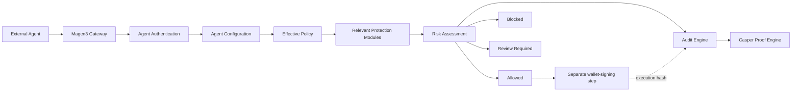

<div align="center">
  

# Magen3

### A modular execution firewall for autonomous blockchain agents

Magen3 protects an agent **before wallet signing or blockchain execution**.

[](#agent-shield)
[](#casper-decision-proofs)
[](#official-integrations)
[](#official-integrations)
[](#official-integrations)
[](LICENSE)

</div>

> [!IMPORTANT]
> Magen3 is a policy, authorization, guidance, audit, and proof layer. It does not hold private keys, approve wallet popups, sign transactions, or guarantee protection from every exploit. The gateway and policy model are chain-agnostic; the current decision-proof implementation uses Casper Testnet.

## Product model

Autonomous agents are gaining the ability to execute swaps, transfers, staking actions, contract calls, and treasury operations. The critical risk is not only what an agent says. It is what the agent is permitted to execute.

Magen3 sits between intent and execution:

```text
External Agent
→ Magen3 Gateway
→ Agent Shield
→ Authenticate Agent
→ Load Agent Configuration
→ Load Effective Policy
→ Run Relevant Protection Checks
→ Risk Assessment
→ Allowed / Blocked / Review Required
→ Audit Log
→ Casper Decision Proof
→ Return Decision to Agent
→ Wallet signing only if Allowed
```

The only final decision states are:

- `Allowed`
- `Blocked`
- `Review Required`

Core authorization is deterministic. A language model is not used to decide whether an action may execute.

## Current implementation status

| Platform component | Status | Current behavior |
| --- | --- | --- |
| Agent Shield | **Live** | Coordinates the complete pre-execution protection flow. |
| Gateway and per-agent authentication | **Live** | Agent ID plus `x-magen3-agent-key` or Bearer token. |
| Execution capabilities | **Live** | Multiple capabilities per agent with backward-compatible legacy mapping. |
| Policy Engine | **Live** | Enforces blocked actions, transaction limits, daily limits, review thresholds, trusted targets, and risk mode. |
| Risk Assessment | **Live** | Combines deterministic findings into one of the three final decisions. |
| Structured findings and guidance | **Live** | Pass, warning, fail, unavailable, or skipped findings with remediation. |
| Audit Engine | **Live** | Stores intent, capabilities, policy, pipeline, findings, decision, reason, proof state, and execution state. |
| Casper Proof Engine | **Live when configured** | Queues and records decision proofs through the existing relayer or manual fallback. |
| Security Coverage | **Live** | Deterministic, explainable configuration-coverage calculation. |
| Integration Health | **Live** | Uses real gateway, credential, policy, request, audit, and proof state. |
| Intent Playground | **Live** | Sends the real current Gateway request format using a registered agent. |
| TypeScript SDK | **Live** | Public beta package: `@magen3/sdk@beta`. |
| Python SDK | **Live** | Official Python client under `packages/sdk-python`. |
| MCP Server | **Live** | Official MCP tools for Codex and compatible runtimes. |

## Agent Shield

Agent Shield is the live centerpiece of Magen3. It is not one small card beside unrelated live products. Protection modules operate under Agent Shield and are evaluated only when relevant to the intent and agent configuration.

### Execution capabilities

An agent may select one or several capabilities:

| Capability | Purpose |
| --- | --- |
| Trading | Swaps, routing, staking, yield actions, and trade execution. |
| Wallet Management | Transfers, destination management, wallet operations, and balance actions. |
| Treasury Operations | DAO or organization funds, high-value actions, and approval-controlled execution. |
| dApp Interactions | Contract calls, DeFi protocols, vaults, staking, borrowing, bridging, and application workflows. |
| Enterprise Automation | Organization workflows, internal permissions, compliance, and controlled automation. |
| Custom | Developer-defined behavior outside the standard categories. |

Convenience packs preselect capabilities but do not lock them:

- Trading Automation Pack
- Treasury Automation Pack
- Enterprise Operations Pack

Legacy agents continue working. When no capability metadata exists, Magen3 maps the existing agent type conservatively; otherwise it falls back to `Custom`.

### Protection areas and control-level status

Magen3 groups related controls into eight protection areas. This keeps the interface focused while preserving control-level transparency. A protection area can contain a mix of Live, Foundation Available, and Planned controls.

| Protection area | Live controls | Foundation controls | Planned controls |
| --- | --- | --- | --- |
| Agent Trust & Access | Agent authentication; credential rotation and revocation; Agent Instruction Integrity | — | Tool and MCP integrity; delegation and session permissions |
| Policy & Approval Controls | Deterministic policy enforcement; review thresholds; Emergency Circuit Breaker; Approval Escalation & Organizational Quorum | Human approval and quorum; Cryptographic reviewer signatures | — |
| Wallet & Asset Safety | Wallet identity, destination validation, spending controls | Asset identity and network consistency | Token behavior and economic-risk analysis |
| Contract & Permission Safety | Contract identity, allowlists, entry points, package versions; Token Approval & Permit Safety; Privileged Contract Action Classification; Contract Upgrade Safety; Contract Argument Policies | — | — |
| Execution Integrity | Transaction construction preflight; lifecycle and replay protection | RPC & Chain Integrity; Gas Sponsorship & Fee Safety; execution/settlement reconciliation; stateful simulation | — |
| Market & Oracle Integrity | Slippage and output-bound structure | Oracle price integrity; MEV/execution quality; trading-route integrity; market-risk signals | Production provider integrations and continuous market monitoring |
| Cross-chain & Payment Controls | — | Bridge routes; x402 authorization and settlement reconciliation | Additional native payment adapters |
| Threat & Compliance | — | Threat-intelligence screening; non-sensitive compliance evidence | Managed risk-provider adapters |

The Security Pipeline still reports the exact evaluator that produced each finding, such as Wallet Validation, Contract Validation, Token Permission Controls, Execution Integrity, Threat Intelligence, Oracle Validation, Bridge Controls, x402 Payment Controls, or Compliance Controls. The grouped UI does not hide technical evidence.

### Live Wallet Validation

Wallet Validation now runs on every authenticated gateway intent before a wallet may be asked to sign. Its deterministic checks include:

- A non-empty Casper execution-wallet public key is required.
- Ed25519 execution keys must use the `01` prefix and valid key length.
- Secp256k1 execution keys must use the `02` prefix and valid key length.
- Wallet-transfer destinations may use a supported Casper public key or `account-hash-...` identifier.
- `Transfer` intents must classify the target as `Wallet Address`.
- Exact source/destination self-transfers are blocked to prevent accidental execution.
- Wallet destinations are checked against the active policy's Trusted Targets list.
- Maximum transaction, daily wallet spending, and review thresholds are evaluated as Wallet Validation findings.
- The execution wallet is evaluated independently from the Magen3 owner wallet.

Malformed execution wallets, malformed destinations, incorrect transfer classification, self-transfers, and hard policy-limit violations return `Blocked`. Valid but unapproved destinations return `Blocked` in Conservative mode and `Review Required` in Balanced or Aggressive mode.

Wallet format validation is structural. It does not claim that an address is funded, controlled by the requester, reputable, or safe from every threat. Threat Intelligence can now compare the submitted normalized identifier with a configured exact-match feed, but it does not derive equivalent account hashes, discover ownership, or guarantee reputation coverage.

Format reference: [Casper Accounts and Cryptographic Keys](https://docs.casper.network/concepts/accounts-and-keys).

### Live Contract Validation

Contract Validation now runs on every intent that declares a contract-oriented action or contract target. The module deterministically checks:

- Contract-oriented actions use the correct target classification.
- The target is a structurally valid Casper Contract Hash or Contract Package Hash.
- Generic `hash-...` values declare whether they represent a Contract Hash or Package Hash.
- Wallet public keys and account hashes cannot masquerade as contracts.
- Direct contract-call actions include a valid entry-point name.
- Package versions are positive integers when supplied; specific Contract Hash calls do not declare package versions.
- An explicit `chainName` matches the configured Casper network.
- Exact policy blocklist matches always return `Blocked`.
- Exact approved-contract matches can proceed when every other check passes.
- Valid but unapproved contracts return `Blocked` in Conservative mode and `Review Required` in Balanced or Aggressive mode.
- Optional `allowedEntryPoints` policy controls can block unauthorized contract methods.

The `Trusted Contract` label is descriptive only. It never grants trust by itself; the exact contract identifier must match the active policy. Structural validation does not prove that a contract is audited, verified, non-upgradeable, or free of malicious logic. Threat Intelligence can add configured exact-match indicators, while bytecode analysis, upgrade-authority analysis, and broader provider coverage remain future work.

Format references: [Calling Contracts](https://docs.casper.network/developers/cli/calling-contracts) and [Contract Hash vs. Package Hash](https://docs.casper.network/next/developers/writing-onchain-code/contract-hash-vs-package-hash).


### Live Token Approval & Permit Safety

Token Permission Controls runs only when an adapter explicitly supplies `action.tokenPermission`. It recognizes supported fungible approvals, allowance changes and resets, permit authorization, NFT operator authority, batch approval, and delegated spender permission without misclassifying generic contract calls.

Deterministic checks cover owner, token, wallet/contract spender, execution-wallet and network binding, approved or blocked spenders, bounded amounts, approval-to-transaction ratio, unlimited authority, permit nonce and expiry, maximum lifetime, NFT operator policy, batch item validity and exact aggregate binding, allowance-reset expectations, and Human Approval binding. Magen3 computes and persists a canonical token-permission fingerprint. Exact permit replay and reuse of a permit ID or token-scoped nonce with changed protected parameters are hard blocked.

Policies expose Observe, Review, and Enforce modes plus explicit actions for unknown spenders and unlimited authority. An empty approved-spender list uses the safe default path rather than treating every spender as trusted. Existing policies and integrations remain compatible because requests without token-permission metadata are skipped rather than treated as approvals. The Gateway rejects permit signatures and raw signed authority payloads. For relevant capabilities, Security Coverage checks bounded configuration and observed evidence, while Integration Health reflects actual Token Permission findings. See `docs/TOKEN_PERMISSION_CONTROLS.md`.

### Live Privileged Contract Action Classification

Privileged Action Controls classifies supported ownership, administrator, proxy or implementation upgrade, role, mint, burn, pause, freeze, withdrawal, oracle, fee-recipient, bridge-validator, and permission changes before signing. It activates for explicit `action.privilegedAction` metadata or an entry point or method signature in Magen3's deterministic supported map. Generic contract calls remain unclassified.

The control validates classifier consistency and provenance, contract and network binding, blocked and review-required action matrices, approved administrators and implementations, required recipients, roles and amounts, and material protected-value changes. Magen3 computes a SHA-256 parameter fingerprint and reuses the exact-intent Human Approval workflow. Per-action quorum can only increase the base quorum; insufficient approvers produce `Configuration Required` instead of silently weakening authorization. See `docs/PRIVILEGED_ACTION_CONTROLS.md`.

### Live Emergency Circuit Breaker

Emergency Circuit Breaker persists scoped pause records independently from agent status, API credentials, and policies. Owners can pause one agent, capability, action, policy, Trading, Contract, Bridge, x402, all execution, or the owner platform scope. Matching requests are deterministically `Blocked` or `Review Required`, with Blocked precedence. Pause state is checked before normal authorization and checked again before execution confirmation.

Manual pause, expiry, direct resume, and approval-gated resume are audited. Automatic triggers are opt-in and can react to replay findings, threat hard matches, oracle disagreement, privileged-action failures, repeated blocks, request-frequency or spending spikes, unresolved execution or x402 state, bridge failures, and proof/provider failures. Automatic activation creates the same persistent record as manual activation. See `docs/EMERGENCY_CIRCUIT_BREAKER.md`.

### Execution Simulation foundation

Execution Simulation now provides deterministic transaction-construction preflight inside the Gateway. It does not claim that the contract executed against Casper global state.

When supplied, Magen3 validates:

- Positive amounts for value-bearing actions.
- Positive-integer payment budgets in motes.
- Positive-integer gas-price tolerance.
- Transaction TTL structure.
- ISO-8601 transaction timestamp structure.
- Expiry when both timestamp and TTL are present.
- Optional 64-character transaction-hash structure.
- Swap slippage bounds between 0 and 10,000 basis points.
- Internal consistency between `expectedOutput` and `minimumReceived`.
- Contract runtime arguments are represented as an object.

Malformed supplied preflight data can return `Blocked`. A structurally valid but unusually long TTL or future-dated timestamp can return `Review Required`. Existing integrations that omit preflight metadata remain backward compatible; missing metadata produces explained warnings rather than a fake pass.

Full Casper speculative execution remains unavailable in the current pre-signing Gateway. Casper exposes speculative execution through a separately enabled node service and expects a constructed deploy or transaction. Magen3 does not accept private keys, wallet approvals, transaction-level signatures, or raw signed transactions through the intent endpoint. Public contract arguments remain allowed inside `runtimeArgs`.

### Live Execution Integrity lifecycle and replay protection

Lifecycle & Replay is a Live control inside the broader Execution Integrity protection area. It closes the gap between a decision being allowed and an equivalent transaction being executed more than once.

Adapters may send the following metadata inside `action.lifecycle`:

```json
{
  "intentId": "intent:transfer-20260723-0001",
  "idempotencyKey": "idempotency:transfer-20260723-0001",
  "sequence": 42,
  "createdAt": "2026-07-23T10:00:00.000Z",
  "expiresAt": "2026-07-23T10:10:00.000Z",
  "attempt": 0
}
```

Magen3 deterministically checks:

- Unique per-agent intent IDs.
- Idempotency-key reuse and parameter mutation.
- Creation time, maximum age, future clock skew, expiry, and maximum lifetime.
- Optional monotonic agent sequence numbers.
- A canonical SHA-256 fingerprint over protected execution parameters.
- Duplicate fingerprints inside the configured replay window.
- Reused transaction hashes.
- Explicit `retryOf` and `replacementOf` references to prior Magen3 audit records.
- Retry prevention while an earlier execution is pending, uncertain, or already confirmed.
- Maximum retry attempts.

New starter policies enable strict Lifecycle & Replay controls. Legacy policies remain non-breaking: duplicate-fingerprint enforcement is not silently activated unless the policy explicitly enables it. Magen3 evaluates unsigned intent metadata only and never accepts private keys, mnemonics, wallet approvals, or transaction signatures.

### AI-native Review Resolution and Human Approval & Quorum

`Review Required` means the action cannot execute yet; it does not automatically mean a person must approve it. Policies independently configure review resolution as **Autonomous**, **Balanced**, or **Human Governed**. Ordinary uncertainty can be returned to the agent as deterministic remediation, while privileged, high-risk, or explicitly governed actions can escalate to Human Approval & Quorum.

Every Blocked or Review Required Gateway response includes a safe `agentMessage`, a structured `decisionExplanation`, and `reviewResolution.humanActionRequired`. External agents can explain the exact primary reason, triggered rule, and suggested resolution without inventing generic text. Instruction-integrity decisions additionally expose stable codes and, when available, the exact affected field, expected value, received value, and changed-field list. Only human-escalated reviews create an approval request bound to a SHA-256 hash of the agent, action, amount, target, execution wallet, policy, and original intent.

Policies can configure:

- Single-approver or quorum mode.
- One to ten required approvals.
- Explicit eligible approver wallets.
- Optional owner-wallet fallback.
- Approval expiry from five minutes to seven days.
- Separation of requester and approver.
- Mandatory rejection comments.

The workflow states are `Pending`, `Approved`, `Rejected`, `Expired`, and `Configuration Required`. One authorized rejection ends the request. Duplicate responses, unauthorized approvers, execution-wallet self-approval under separation of duties, and execution after expiry are rejected. Changing a protected intent parameter changes the binding hash and requires a new decision.

Agents can poll the request with their existing agent credential, while reviewers resolve it from **Policies → Approval Queue**. Signature-enabled policies issue a one-time domain-separated and chain-bound challenge that the authorized Casper Wallet account signs before its response counts toward quorum. Magen3 verifies Ed25519 and Secp256k1 signatures, prevents challenge replay, and stores signature hashes plus verification evidence rather than raw signatures. An approved request still permits progression only to the separate human-controlled wallet-signing boundary; it does not sign or broadcast a transaction. The control remains Foundation Available until the deployed browser flow is verified end to end. See [`docs/HUMAN_APPROVAL_WORKFLOW.md`](docs/HUMAN_APPROVAL_WORKFLOW.md) and [`docs/CRYPTOGRAPHIC_REVIEWER_SIGNATURES.md`](docs/CRYPTOGRAPHIC_REVIEWER_SIGNATURES.md).

### Approval Escalation & Organizational Quorum

Approval Escalation & Organizational Quorum is now **Live** inside Policy & Approval Controls. It extends the same exact-bound request with named approver groups, deterministic value/action/capability/contract tiers, timed backup and emergency escalation, role-specific quorum, execution delays, and bounded signing windows.

The total distinct quorum is never allowed to fall below the sum of required role quotas. Backup wallets may satisfy only roles that explicitly designate their group as a backup, and only after the configured escalation activates. Invalid group references, impossible reviewer counts, duplicate identifiers, or delays that outlive approval expiry produce `Configuration Required` rather than weaker authorization. Existing flat-quorum policies remain compatible. See [`docs/APPROVAL_ESCALATION_ORGANIZATIONAL_QUORUM.md`](docs/APPROVAL_ESCALATION_ORGANIZATIONAL_QUORUM.md).

### Threat Intelligence foundation

Threat Intelligence now evaluates normalized wallet, account-hash, Contract Hash, and Package Hash identities against an operator-configured JSON feed. It is **Foundation Available**, not Live, because Magen3 does not bundle or endorse an external reputation provider and cannot guarantee the completeness or accuracy of operator-supplied intelligence.

Current behavior:

- Loads one feed from `THREAT_INTELLIGENCE_FEED_JSON`, `THREAT_INTELLIGENCE_FEED_PATH`, or `THREAT_INTELLIGENCE_FEED_URL`.
- Requires a valid source `generatedAt` timestamp before a feed can count as fresh.
- Applies a configurable maximum feed age and in-memory cache; missing, invalid, or materially future-dated timestamps are treated as stale.
- Performs deterministic exact matching only; it does not infer related wallets, derive an account hash from a public key, or equate Contract Hashes with Package Hashes.
- Records feed availability, checked identities, matched indicator metadata, confidence, severity, source, and remediation in structured findings and audit evidence.
- Never treats a stale or unavailable feed as a pass.
- Rejects oversized or malformed feeds and does not expose the configured API key, internal feed path, raw remote URL, or raw loader error in public status responses.

Policy controls under `structuredRules`:

- `threatIntelligenceMode`: `Observe`, `Review`, or `Enforce`.
- `threatIntelligenceMinConfidence`: integer from `0` to `100`.
- `threatIntelligenceUnavailableAction`: `Warn`, `Review`, or `Block`.

In `Enforce` mode, high- and critical-severity matches at or above the confidence threshold block execution; medium-severity matches require review. In `Review` mode, medium-or-higher matches require review. `Observe` records a warning without changing the final authorization. A below-threshold match is visible but is not enforced.

The repository includes `backend/data/threat-intelligence.example.json` for local testnet demonstration only. Its indicators are synthetic and must not be represented as production intelligence. See [`docs/THREAT_INTELLIGENCE.md`](docs/THREAT_INTELLIGENCE.md).


### Oracle Validation foundation

Oracle Validation evaluates price-sensitive intents against an operator-configured multi-source feed before wallet signing. It is **Foundation Available**, not Live, because Magen3 does not bundle or certify a production oracle provider and does not currently verify cryptographic on-chain price attestations.

Current deterministic checks include:

- Base asset, quote asset, proposed execution price, and quote-timestamp metadata.
- Feed availability and source `generatedAt` freshness.
- Exact requested asset-pair availability.
- Per-observation freshness.
- Minimum independent-source quorum.
- Aggregate confidence threshold.
- Maximum cross-source price spread.
- Maximum deviation between the proposed execution price and the median reference price.
- `Observe`, `Review`, and `Enforce` behavior.
- `Warn`, `Review`, or `Block` behavior when the feed or pair is unavailable.

A stale, unavailable, low-confidence, or divergent feed never counts as a pass. Magen3 stores only sanitized feed context and structured findings in the Gateway response and audit log; provider credentials and raw configured locations remain server-side.

The repository includes `backend/data/oracle-validation.example.json` with synthetic values for a controlled testnet demo. Refresh its timestamps before use:

```bash
pnpm oracle:refresh-example-feed
```

See [`docs/ORACLE_VALIDATION.md`](docs/ORACLE_VALIDATION.md) for the feed schema, intent fields, policy controls, deployment settings, and security boundary.

### Bridge Controls foundation

Bridge Controls evaluates provider-supplied cross-chain route metadata before wallet signing. It is **Foundation Available**, not Live, because Magen3 does not operate a bridge adapter, certify a bridge provider, verify provider liquidity or solvency, or confirm cross-chain message delivery.

Current deterministic checks include:

- Required source chain, destination chain, provider, route ID, destination address, and asset metadata.
- Approved provider and source/destination-chain lists.
- Explicit destination-chain blocks.
- Allowed bridged assets and maximum bridge amount.
- Maximum route fee in basis points.
- Quote age and optional mandatory expiry.
- Internal consistency between expected output and minimum received.
- Casper and EVM destination-address structure for recognized chain families.
- Minimum source and destination confirmation requirements.
- `Observe`, `Review`, and `Enforce` handling plus `Warn`, `Review`, or `Block` behavior when route metadata is unavailable.

An unknown destination-chain address family is reported as unavailable rather than silently passing. A structurally valid destination does not prove account ownership, bridge safety, destination-chain liveness, or successful delivery.

See [`docs/BRIDGE_CONTROLS.md`](docs/BRIDGE_CONTROLS.md) for the request schema, policy controls, decision behavior, and security boundary.

### x402 Payment Controls foundation

x402 Payment Controls evaluates paid HTTP-resource requirements before an autonomous agent creates `PAYMENT-SIGNATURE`. It is **Foundation Available**, not Live, because Magen3 does not sign payments, operate a facilitator, certify merchants, or independently prove resource delivery.

Current deterministic checks include:

- Explicit policy enablement and exact-scheme support.
- Canonical resource URL, HTTPS, merchant hostname, intent target, and secret-free URL checks.
- CAIP-2 network, EVM or Solana recipient structure, asset, facilitator, merchant, and recipient allowlists.
- Atomic token amount conversion using configured asset decimals and exact consistency with `action.amount`.
- Per-payment, daily, monthly, hourly, and human-review limits.
- Expiration from an explicit `validUntil` or x402 v2 `maxTimeoutSeconds` plus a stable `requirementsReceivedAt` timestamp.
- `PAYMENT-REQUIRED`, unsafe-method request body, unique request ID, and canonical request-fingerprint binding.
- Audit-backed replay detection and ambiguous-settlement retry prevention.
- Authenticated settlement reconciliation with monotonic attempt, transaction-hash, confirmation, and resource-delivery state.

Magen3 rejects private keys, mnemonics, wallet approvals, `PAYMENT-SIGNATURE`, signed payment payloads, and secret-bearing resource URLs before audit persistence. A passing decision does not make the paid response trustworthy; agents must still treat paid content as untrusted input.

See [`docs/X402_PAYMENT_CONTROLS.md`](docs/X402_PAYMENT_CONTROLS.md) for the request schema, policy fields, SDK flow, settlement endpoint, replay model, UI placement, and security boundary.

### Compliance Controls foundation

Compliance Controls evaluates non-sensitive compliance evidence and operator-configured exact-match restrictions before wallet signing. It is **Foundation Available**, not Live, because Magen3 does not bundle or certify a KYC/KYB provider, sanctions-data provider, legal rules engine, or jurisdiction-specific compliance determination.

Current deterministic checks include:

- Originator and beneficiary attestation status, provider, opaque reference, issue time, and expiry.
- Opaque Travel Rule workflow status, reference, and optional data hash.
- Originator and beneficiary two-letter jurisdiction policy.
- Counterparty type policy for VASPs, self-hosted wallets, organizations, and individuals.
- External screening status, provider, opaque reference, and freshness.
- Maximum permitted risk rating.
- Exact wallet, account-hash, Contract Hash, Package Hash, and VASP-ID matches from a configured feed.
- Feed-generated timestamp, expiry, cache, size, timeout, and unavailable behavior.
- `Observe`, `Review`, and `Enforce` handling plus `Warn`, `Review`, or `Block` behavior when required evidence is unavailable.

The Gateway rejects names, dates of birth, identity-document numbers, residential addresses, email addresses, phone numbers, documents, selfies, and biometric data. External verification systems should retain personal data and send Magen3 only status, provider labels, opaque references, timestamps, jurisdiction codes, and hashes.

A clear screening result or exact-feed no-match does not guarantee regulatory compliance. Policy configuration and operator-supplied evidence remain subject to the operator's legal and risk review.

The repository includes `backend/data/compliance-controls.example.json` with synthetic test records. Refresh its timestamp before a controlled demo:

```bash
pnpm compliance:refresh-example-feed
```

See [`docs/COMPLIANCE_CONTROLS.md`](docs/COMPLIANCE_CONTROLS.md) for the evidence schema, policy controls, feed format, privacy boundary, and deployment guidance.

## First Agent Setup

Magen3 now offers two onboarding paths from Dashboard, Agent Shield, Connected Agents, Intent Playground, Policies, and Settings.

### Guided Setup — default

Guided Setup reduces the first protected-agent journey to four product decisions:

1. Choose what Magen3 should protect: Trading, Wallet, Treasury, DeFi/dApp, Enterprise, or Custom.
2. Name the agent and choose Codex, MCP, JavaScript, Python, Custom API, or integrate later.
3. Select Standard, Strict, or Custom protection. Magen3 infers capabilities, relevant protection areas, limits, review thresholds, and starter-policy rules.
4. Save the one-time API key and run a synthetic protected Gateway test.

The onboarding test uses the real authenticated Gateway and creates a real decision and audit record. It never requests a wallet signature or submits a blockchain transaction. A clearly labelled demo configuration is also available for product exploration.

### Advanced Setup

The original six-step registration workflow remains available:

1. Agent Details
2. Execution Capabilities
3. Recommended Protection
4. Starter Policy
5. Review
6. Integration Credentials and Quick Start

Advanced Setup exposes the full capability, protection, policy-template, and configuration flow. Existing policies can still be used as templates without rebinding the original record.

The Dashboard shows a browser-scoped completion checklist for agents created through the new onboarding flow: agent, policy, credential acknowledgement, first intent, and confirmed Casper proof. Existing agents are not forced into the checklist.

Raw API keys are shown only after registration or rotation. Magen3 stores the key digest and preview, not the recoverable raw secret.

See [`docs/FIRST_AGENT_SETUP.md`](docs/FIRST_AGENT_SETUP.md) and [`FIRST_AGENT_ONBOARDING_IMPLEMENTATION_REPORT.md`](FIRST_AGENT_ONBOARDING_IMPLEMENTATION_REPORT.md).

## Policies

Supported policy fields are enforced by the current backend:

- Maximum transaction amount
- Daily spending limit
- Human-review threshold
- Trusted contracts or destinations
- Blocked contracts through `structuredRules.blockedContracts`
- Optional allowed entry points through `structuredRules.allowedEntryPoints`
- Blocked action types
- Conservative, Balanced, or Aggressive risk mode
- Threat Intelligence mode, minimum confidence, and unavailable-feed behavior through `structuredRules`
- Oracle Validation mode, quote age, maximum deviation, source spread, confidence, source quorum, and unavailable-feed behavior through `structuredRules`
- Bridge Controls provider, chain, asset, amount, fee, quote, destination, and confirmation boundaries through `structuredRules`
- Compliance Controls attestation, Travel Rule, jurisdiction, counterparty, screening, risk, provider, freshness, and unavailable-evidence behavior through `structuredRules`
- Token Permission Controls mode, spender lists, unlimited-approval action, amount and ratio limits, permit lifetime, nonce, chain binding, batch, NFT operator, and allowance-reset requirements through `structuredRules`
- Privileged Action Controls mode, review and block matrices, administrator and implementation allowlists, unknown-action behavior, and per-action quorum through `structuredRules`

Available presets:

- Conservative Trading
- Balanced Trading
- Wallet Safety
- Treasury Safe Mode
- DeFi Automation
- Enterprise Controlled Automation
- Custom

Policy-specific maximum slippage, full state simulation, provider solvency, cross-chain delivery verification, legal determinations, and any unconfigured external provider are not represented as live authorization rules. Structural swap bounds and transaction-construction preflight are available through Execution Simulation. Threat Intelligence and Oracle Validation provide configurable deterministic feed checks but remain Foundation Available rather than claiming comprehensive reputation coverage or guaranteed market truth.

## Structured findings and decisions

Protection checks emit findings such as:

```json
{
  "module": "Policy Enforcement",
  "status": "fail",
  "severity": "high",
  "rule": "Maximum transaction amount",
  "message": "Requested amount exceeds the active policy limit.",
  "evidence": {
    "received": 60,
    "maximum": 50
  },
  "remediation": "Reduce the amount to 50 CSPR or less, or update the policy if authorized."
}
```

A module can report `pass`, `warning`, `fail`, `unavailable`, or `skipped`. `unavailable` never becomes an implicit pass.

Each decision includes deterministic guidance where available:

- Primary reason
- Relevant policy
- Triggered rule
- Module findings
- Suggested resolution
- Pipeline stages

## Gateway API

### Verify an agent

```http
GET /api/agent-gateway/me?agentId=MAG-AGENT-...
x-magen3-agent-key: YOUR_AGENT_API_KEY
```

### Submit an intent

```http
POST /api/agent-gateway/intents
Content-Type: application/json
x-magen3-agent-key: YOUR_AGENT_API_KEY
```

```json
{
  "source": "YieldBot AI",
  "agentId": "MAG-AGENT-...",
  "walletAddress": "EXECUTION_WALLET_PUBLIC_KEY",
  "executionWalletAddress": "EXECUTION_WALLET_PUBLIC_KEY",
  "goal": "Stake 15 CSPR to a trusted validator",
  "reason": "The external agent prepared this action and needs approval before execution.",
  "action": {
    "type": "Stake",
    "amount": 15,
    "asset": "CSPR",
    "target": "VALIDATOR_OR_CONTRACT_ADDRESS",
    "targetType": "Trusted Contract",
    "preflight": {
      "paymentAmountMotes": "5000000000",
      "gasPriceTolerance": 1,
      "ttl": "30m",
      "timestamp": "2026-07-22T10:00:00.000Z"
    }
  }
}
```

The owner wallet that registered the agent and the execution wallet supplied by the external agent may be different.

Contract-call example:

```json
{
  "source": "YieldBot AI",
  "agentId": "MAG-AGENT-...",
  "executionWalletAddress": "EXECUTION_WALLET_PUBLIC_KEY",
  "goal": "Call an approved vault contract",
  "action": {
    "type": "Contract Interaction",
    "amount": 0,
    "asset": "CSPR",
    "target": "contract-0123456789abcdef0123456789abcdef0123456789abcdef0123456789abcdef",
    "targetType": "Trusted Contract",
    "contractIdentifierType": "Contract Hash",
    "entryPoint": "deposit",
    "chainName": "casper-test",
    "preflight": {
      "paymentAmountMotes": "5000000000",
      "gasPriceTolerance": 1,
      "ttl": "30m",
      "timestamp": "2026-07-22T10:00:00.000Z",
      "runtimeArgs": {
        "amount": "1000000000"
      }
    }
  }
}
```

For a Package Hash, use `contractIdentifierType: "Package Hash"`; `contractVersion` is optional and must be a positive integer when supplied.

Machine-readable reference:

```http
GET /api/agent-gateway/spec
```

## Intent Playground

The in-app Intent Playground:

- Selects an active registered agent
- Uses the existing API-key authentication contract
- Provides editable wallet, contract, execution-preflight, lifecycle/replay, x402, bridge, oracle, compliance, and human-approval examples
- Validates JSON before submission
- Displays the real response, decision, risk, findings, explanation, pipeline, audit ID, and any exact-bound approval request
- Keeps the entered raw key in page state rather than adding it to request JSON or persistent storage

## Security Coverage

Security Coverage is deterministic configuration coverage, not a trust or invulnerability score. It evaluates explainable factors such as:

- Capabilities selected
- Active policy assigned
- Relevant limits and destination controls configured
- Contract controls for dApp interactions
- Review thresholds for treasury actions
- Active credential
- Recent gateway activity
- Execution preflight observations for relevant capabilities
- Casper proof observations
- Completed active agent configuration

Every included check displays its weight, current state, and recommendation. A score of 100% means the configured checks are present, not that every exploit is impossible.

## Audit Logs and execution timeline

New gateway audit records can include:

- Original intent
- Agent and execution capabilities
- Active policy
- Pipeline stages
- Modules checked
- Structured findings
- Final decision and risk score
- Primary reason and triggered rule
- Suggested remediation
- Decision payload hash
- Casper proof state and deploy hash
- Execution status and deploy hash
- Submitted, confirmed, and updated timestamps

The frontend refreshes wallet-scoped data automatically while connected. New decisions no longer require a manual page refresh or wallet reconnection.

## Casper decision proofs

Magen3 distinguishes two proofs:

| Proof | Meaning |
| --- | --- |
| Casper Decision Proof | Magen3 evaluated and recorded the intent and decision. |
| Execution Proof | The external execution wallet later signed and submitted the approved transaction. |

A blocked or review-required intent may have a decision proof but should not have an execution proof.

Current runtime contract hash:

```text
hash-b08ae51143e0d2fa78761e7819010e4c941dba3734252cdcf28ea7176cd4abcf
```

The upgrade does not change this contract hash or the `record_decision` entrypoint.

## Official integrations

### TypeScript

Install the public beta in the external agent backend:

```bash
pnpm add @magen3/sdk@beta
```

```env
MAGEN3_GATEWAY_URL=https://magen3-production.up.railway.app
MAGEN3_AGENT_ID=MAG-AGENT-...
MAGEN3_API_KEY=YOUR_PRIVATE_AGENT_KEY
```

`MAGEN3_GATEWAY_URL` is the API base URL only. The SDK adds `/api/agent-gateway/...` routes itself.

```ts
import { Magen3Client } from "@magen3/sdk";

const client = Magen3Client.fromEnv(process.env);
const response = await client.checkIntent(intent);
```

Use `requireAllowed(intent)` for a fail-closed execution gate.

### Python

```bash
python -m pip install -e packages/sdk-python
```

```python
from magen3 import Magen3Client

client = Magen3Client.from_env()
response = client.check_intent(intent)
```

Use `require_allowed(intent)` for a fail-closed execution gate.

### MCP and Codex

```bash
pnpm mcp:build
```

The MCP server provides:

- `magen3_verify_agent`
- `magen3_get_intent_schema`
- `magen3_check_intent`
- `magen3_require_allowed`

See [`docs/MCP_SERVER.md`](docs/MCP_SERVER.md) for Codex configuration and the real-agent test flow.

### Agent Skills Kit

Connected Agents can export current Agent ID, routes, environment variables, cURL/fetch examples, and instruction blocks for Codex, Claude, or custom autonomous runtimes.

## Architecture



### Main technical components

- React 19, TypeScript, Vite, Tailwind CSS
- Node.js HTTP backend
- PostgreSQL with Drizzle ORM
- In-memory development fallback only when `ALLOW_MEMORY_STORE=true`
- Casper Wallet browser integration
- Casper Testnet audit registry and relayer
- TypeScript SDK, Python SDK, and MCP server

## Database changes

Migration `backend/db/migrate.mjs` is additive and preserves existing records. It adds:

### Agents

- `execution_capabilities`
- `capability_configuration`
- `onboarding_status`
- `last_intent_at`
- `last_decision_at`

### Policies

- `template_type`
- `capability_scope`
- `structured_rules`

### Audit records

- `original_intent`
- `pipeline_stages`
- `module_findings`
- `primary_reason`
- `triggered_rule`
- `suggested_resolution`
- `capability_context`
- `proof_submitted_at`
- `proof_confirmed_at`

Legacy data is retained. Existing IDs, API-key hashes, policies, audit logs, gateway routes, headers, deployment settings, wallet flow, SDK/MCP contracts, and Casper contract hash remain unchanged.

## Local development

### Prerequisites

- Node.js 20 or newer
- Corepack
- pnpm 10.14.0
- PostgreSQL for persistent storage, or explicit memory mode for local-only testing
- Casper Wallet extension for browser wallet tests

### Install

```bash
corepack enable
pnpm install --frozen-lockfile
cp .env.example .env
```

For persistent local storage, set `DATABASE_URL`. For temporary local testing only:

```env
ALLOW_MEMORY_STORE=true
```

Run the database migration:

```bash
pnpm db:migrate
```

Run backend and frontend in separate terminals:

```bash
pnpm dev:backend
pnpm dev:frontend
```

Frontend: `http://localhost:5173`  
Backend: `http://localhost:8787`

## Environment variables

Use `.env.example` as the source of truth.

### Frontend

```env
VITE_API_URL=http://localhost:8787
VITE_CASPER_NETWORK=casper-testnet
VITE_CASPER_RPC_URL=https://node.testnet.casper.network/rpc
VITE_MAGEN3_CONTRACT_HASH=hash-b08ae51143e0d2fa78761e7819010e4c941dba3734252cdcf28ea7176cd4abcf
```

### Backend and database

```env
PORT=8787
PUBLIC_API_BASE_URL=http://localhost:8787
CORS_ORIGIN=http://localhost:5173
DATABASE_URL=postgresql://...
DATABASE_SSL=false
ALLOW_MEMORY_STORE=false
```

### External agent integration

Use the same canonical variables for the TypeScript SDK, Python SDK, examples, and MCP server:

```env
MAGEN3_GATEWAY_URL=https://magen3-production.up.railway.app
MAGEN3_AGENT_ID=MAG-AGENT-...
MAGEN3_API_KEY=YOUR_PRIVATE_AGENT_KEY
```

The Gateway value is the backend base URL, not the `/api/agent-gateway/intents` endpoint. Keep the API key in the external agent backend only.

### Casper proof service

```env
CASPER_NETWORK=casper-testnet
CASPER_CHAIN_NAME=casper-test
CASPER_RPC_URL=https://node.testnet.casper.network/rpc
MAGEN3_CONTRACT_HASH=hash-b08ae51143e0d2fa78761e7819010e4c941dba3734252cdcf28ea7176cd4abcf
CASPER_RECORDING_MODE=relayer
CASPER_AUTO_RECORD_DECISIONS=true
CASPER_RELAYER_SECRET_KEY_PATH=/secure/path/secret_key.pem

# Optional post-authorization transaction polling; disabled by default
RECONCILIATION_POLLING_ENABLED=true
RECONCILIATION_CASPER_RPC_URL=https://node.testnet.casper.network/rpc
# RECONCILIATION_EVM_RPC_URL=https://approved-evm-rpc.example
RECONCILIATION_POLL_TIMEOUT_MS=10000
```

Use only one relayer key source in production. Never commit real keys.

### Threat Intelligence foundation

Configure exactly one feed source:

```env
# Preferred for Railway: JSON stored as a protected environment variable
THREAT_INTELLIGENCE_FEED_JSON={"version":"1","source":"Reviewed feed","generatedAt":"2026-07-22T12:00:00.000Z","indicators":[]}

# Or a mounted/local file path
# THREAT_INTELLIGENCE_FEED_PATH=backend/data/threat-intelligence.example.json

# Or a remote HTTPS JSON endpoint
# THREAT_INTELLIGENCE_FEED_URL=https://security.example/threat-feed.json
# THREAT_INTELLIGENCE_API_KEY=provider-secret

THREAT_INTELLIGENCE_CACHE_TTL_MS=300000
THREAT_INTELLIGENCE_MAX_AGE_MS=86400000
THREAT_INTELLIGENCE_REQUEST_TIMEOUT_MS=2500
```

Do not configure more than one source; precedence is inline JSON, then file path, then remote URL. `THREAT_INTELLIGENCE_API_KEY` is used only as a Bearer credential for the remote feed and is never returned by the API. The example feed is synthetic and intended only for a controlled testnet demo.


### Oracle Validation foundation

Configure exactly one oracle-feed source:

```env
# Preferred for Railway: JSON stored as a protected environment variable
ORACLE_VALIDATION_FEED_JSON={"version":"1","source":"Reviewed oracle adapter","generatedAt":"2026-07-22T15:00:00.000Z","observations":[]}

# Or a mounted/local file path
# ORACLE_VALIDATION_FEED_PATH=backend/data/oracle-validation.example.json

# Or a remote HTTPS JSON endpoint
# ORACLE_VALIDATION_FEED_URL=https://oracle.example/feed.json
# ORACLE_VALIDATION_API_KEY=provider-secret

ORACLE_VALIDATION_CACHE_TTL_MS=60000
ORACLE_VALIDATION_MAX_FEED_AGE_MS=300000
ORACLE_VALIDATION_REQUEST_TIMEOUT_MS=2500
```

Do not configure more than one source; precedence is inline JSON, then file path, then remote URL. The included example feed is synthetic and must be refreshed with `pnpm oracle:refresh-example-feed` immediately before a controlled demo. Confirm `/api/oracle-validation/status` after backend deployment.

### Compliance Controls foundation

Configure at most one optional restriction-feed source:

```env
# Preferred for Railway: JSON stored as a protected environment variable
COMPLIANCE_CONTROLS_FEED_JSON={"version":"1","source":"Reviewed compliance feed","generatedAt":"2026-07-22T18:00:00.000Z","indicators":[],"restrictedJurisdictions":[]}

# Or a mounted/local file path
# COMPLIANCE_CONTROLS_FEED_PATH=backend/data/compliance-controls.example.json

# Or a remote HTTPS JSON endpoint
# COMPLIANCE_CONTROLS_FEED_URL=https://compliance.example/feed.json
# COMPLIANCE_CONTROLS_API_KEY=provider-secret

COMPLIANCE_CONTROLS_CACHE_TTL_MS=300000
COMPLIANCE_CONTROLS_MAX_AGE_MS=86400000
COMPLIANCE_CONTROLS_REQUEST_TIMEOUT_MS=2500
```

Feed precedence is inline JSON, then file path, then remote URL. Provider credentials, raw locations, and feed contents are never returned by the public status endpoint. The included feed is synthetic and should be refreshed with `pnpm compliance:refresh-example-feed` immediately before a controlled demo. Confirm `/api/compliance-controls/status` after backend deployment.


## Roadmap progress

Phase 1 deterministic permission and approval safety is complete. Phase 2 includes **Agent Instruction Integrity** and **Tool & MCP Integrity** as Live controls, while **Delegation & Session Key Safety** is Foundation Available pending deployed connected-wallet verification. Phase 3 now includes **RPC & Chain Integrity**, **Gas Sponsorship & Fee Safety**, and **Execution & Settlement Reconciliation** as Foundation Available pending deployed trusted-adapter and real-network verification. **Cryptographic Reviewer Signatures** remains Foundation Available pending deployed Casper Wallet browser verification. Magen3 is not finished. The next recommended milestone is **Real Stateful Execution Simulation**. Provider-backed controls remain Foundation Available until their published Live criteria are satisfied.

## Verification

```bash
pnpm verify
```

This runs:

- TypeScript type checking
- Backend tests
- TypeScript SDK build and tests
- Python SDK tests
- MCP build and tests
- Production Vite build

There is no separate lint script in the current project.

## Railway deployment

The repository retains the existing Dockerfile and `railway.json`.

1. Add PostgreSQL to the Railway project.
2. Set `DATABASE_URL` and production environment variables.
3. Set `CORS_ORIGIN` to the deployed Vercel frontend origin. Multiple origins require the backend configuration to support them; do not use `*` with sensitive production deployments unless intentionally accepted.
4. Deploy the backend.
5. Run `pnpm db:migrate` against the production database before relying on the Human Approval & Quorum fields.
6. Confirm `/api/health`, `/api/approval-workflow/status`, `/api/token-permission-controls/status`, `/api/privileged-action-controls/status`, `/api/execution-integrity/status`, `/api/threat-intelligence/status`, `/api/oracle-validation/status`, `/api/compliance-controls/status`, `/api/rpc-chain-integrity/status`, `/api/public-config`, and `/api/agent-gateway/spec`.

The start command remains:

```bash
pnpm start
```

## Vercel deployment

The existing `vercel.json` remains valid.

1. Set `VITE_API_URL` to the Railway backend origin.
2. Preserve the Casper Testnet and contract-hash variables.
3. Deploy the Vite frontend.
4. Confirm wallet gating, fixed navigation, agent registration, Intent Playground, and audit auto-refresh.

## Demo flow

1. Explain the execution-risk problem.
2. Show Agent Shield as the live pre-execution system.
3. Register an agent and select multiple capabilities.
4. Review recommended protection and starter policy.
5. Copy one-time credentials.
6. Submit the bounded token-approval example and inspect the Token Permission Controls finding and fingerprint.
7. Submit the unknown-spender or unlimited-approval example and inspect Review Required or Blocked according to policy.
8. Submit a Review Required intent, open Policies → Approval Queue, and resolve the exact-bound request.
9. Poll the approval as the external agent, then show that execution confirmation remains blocked until quorum is complete and unexpired.
10. Submit the permit-replay example twice and show the second request being blocked.
11. When a fresh demonstration feed is configured, submit the synthetic Threat Intelligence match and inspect the exact indicator evidence.
12. Refresh and configure the synthetic Oracle Validation feed, then submit within-bounds, deviation, and stale-quote examples.
13. Configure the synthetic Compliance Controls feed and submit complete-evidence, incomplete-Travel-Rule, and exact-match examples.
14. Open the audit detail and show findings, explanation, pipeline, and proof state.
15. Show the Casper decision proof and, for an executed Allowed action, the separate execution hash.

## Security considerations

- Keep API keys and relayer secrets outside source control.
- Rotate a lost key; it cannot be recovered from its hash.
- Revoke compromised agents immediately.
- Never treat `Allowed` as a wallet signature.
- Validate action parameters again at the execution boundary.
- Keep PostgreSQL backups before production migrations.
- Restrict CORS and Railway environment access.
- Foundation, Preview, and Planned labels describe implementation maturity; only actual findings, the final decision, and—when configured—a completed unexpired exact-bound approval authorize progression to signing.
- Review the provenance, freshness, confidence, and legal basis of any configured threat feed. An exact no-match is not proof that a target is safe.
- A high Security Coverage score does not imply invulnerability.
- Never submit raw personal identity data to Magen3. Keep PII with the external verification provider and send only non-sensitive statuses, opaque references, timestamps, jurisdiction codes, and hashes.
- Treat Compliance Controls as a deterministic policy and evidence layer, not legal advice or a guarantee of regulatory compliance.

## Troubleshooting

| Problem | Check |
| --- | --- |
| Backend will not start | Set `DATABASE_URL`, or explicitly use `ALLOW_MEMORY_STORE=true` for temporary local testing. |
| Gateway unavailable | Confirm backend health and `VITE_API_URL`. |
| Invalid agent API key | Use the latest key or rotate it from Connected Agents. |
| No active policy | Complete onboarding or create an active policy for the agent. |
| Approval stays Configuration Required | Add eligible approver wallets or enable owner-wallet fallback on the active policy. |
| Agent cannot proceed after Review Required | Inspect `reviewResolution`: remediate and resubmit when autonomous, or poll the approval only when `humanActionRequired` is true. |
| Token permission intent is skipped | Include an explicit `action.tokenPermission` object with a supported `permissionType`; generic contract calls are intentionally not classified as approvals. |
| Approval response rejected | Confirm the connected wallet is an eligible approver, has not already responded, and is not the execution wallet when separation of duties is enabled. |
| Threat feed unavailable | Configure one feed source, verify JSON structure, and check `/api/threat-intelligence/status`. |
| Threat feed stale | Publish a current `generatedAt` value or adjust `THREAT_INTELLIGENCE_MAX_AGE_MS` only after reviewing the operational risk. |
| Compliance feed unavailable | Configure one feed source when exact matching is required, verify JSON structure, and check `/api/compliance-controls/status`. Policy unavailable behavior still applies when no feed is configured. |
| Compliance request rejected | Remove names, identity documents, addresses, contact information, biometrics, and other raw PII. Submit only supported non-sensitive evidence fields. |
| Audit records appear stale | Confirm the wallet is still connected and the backend bootstrap route is reachable. The UI polls every six seconds. |
| Decision proof pending | Check relayer configuration, contract hash, funded relayer account, and audit proof error. |
| Casper Wallet unavailable | Install, unlock, and approve Casper Wallet in the browser. |
| Intent Playground rejects JSON | Match the selected Agent ID and include a supported `action` object. |

## Cross-panel information architecture

The authenticated application now uses one clear primary home for each kind of information: Dashboard for cross-platform operations, Agent Shield for protection posture, Connected Agents for agent lifecycle and integration, Policies for deterministic rules and approvals, Audit Logs for complete historical evidence, Intent Playground for authenticated testing, Settings for environment and administration, and Docs for tutorials and reference. Global network, Gateway, and wallet state are centralized in the application top bar. Contextual summaries remain only where they help the current workflow. See [`CROSS_PANEL_INFORMATION_ARCHITECTURE_IMPLEMENTATION_REPORT.md`](CROSS_PANEL_INFORMATION_ARCHITECTURE_IMPLEMENTATION_REPORT.md).

## Repository structure

```text
src/                         React/Vite application
backend/                     Gateway, stores, policy/risk logic, migrations, Casper proof service
contracts/                   Casper audit-registry contract
packages/sdk-js/             Official TypeScript SDK
packages/sdk-python/         Official Python SDK
packages/mcp-server/         Official MCP server
docs/                        Product, API, integration, SDK, MCP, and Casper documentation
scripts/casper/              Contract and proof tooling
```

## Additional documentation

- [`docs/MAGEN3_PLATFORM.md`](docs/MAGEN3_PLATFORM.md)
- [`docs/AGENT_GATEWAY_API.md`](docs/AGENT_GATEWAY_API.md)
- [`docs/TOOL_MCP_INTEGRITY.md`](docs/TOOL_MCP_INTEGRITY.md)
- [`docs/GATEWAY_INTEGRATION.md`](docs/GATEWAY_INTEGRATION.md)
- [`docs/OFFICIAL_SDKS.md`](docs/OFFICIAL_SDKS.md)
- [`docs/HUMAN_APPROVAL_WORKFLOW.md`](docs/HUMAN_APPROVAL_WORKFLOW.md)
- [`docs/TOKEN_PERMISSION_CONTROLS.md`](docs/TOKEN_PERMISSION_CONTROLS.md)
- [`docs/CONTRACT_ARGUMENT_POLICIES.md`](docs/CONTRACT_ARGUMENT_POLICIES.md)
- [`docs/MARKET_RISK_SIGNALS.md`](docs/MARKET_RISK_SIGNALS.md)
- [`docs/MCP_SERVER.md`](docs/MCP_SERVER.md)
- [`docs/CASPER_DEPLOYMENT_PLAYBOOK.md`](docs/CASPER_DEPLOYMENT_PLAYBOOK.md)

## License

MIT. See [`LICENSE`](LICENSE).


## Contract Upgrade Safety

Contract Upgrade Safety is Live under Agent Shield → Contract & Permission Safety. It binds the current and proposed implementation, optional code hashes, authorized upgrade administrator, configured delay, exact parameter fingerprint, and Human Approval quorum before wallet signing. See `docs/CONTRACT_UPGRADE_SAFETY.md`.


## Contract Argument Policies

Contract Argument Policies is Live under Agent Shield → Contract & Permission Safety. It matches the exact contract and entry point, then enforces required and allowed argument names, value types, numeric ranges, address allowlists/blocklists, boolean restrictions, and enum values before wallet signing. Magen3 returns a canonical runtime-argument fingerprint, structured findings, and exact Human Approval binding evidence. See `docs/CONTRACT_ARGUMENT_POLICIES.md`.


## Agent Instruction Integrity

Agent Instruction Integrity is Live under Agent Shield → Agent Trust & Access. Sensitive actions may include `action.instructionIntegrity` with a stable goal ID, original user-goal hash, source provenance, confirmation state, protected-parameter hashes, an optional non-secret original protected-parameter snapshot, and original/current tool permission scopes. Magen3 deterministically checks goal binding, source-domain policy, parameter changes, external-content confirmation, x402 self-authorization, and tool scope expansion before signing. The official SDK binding helpers generate compatible hashes and snapshots so Magen3 can identify exact amount, destination, asset, network, contract, method, action-type, or runtime-argument mismatches. It stores hashes and minimal provenance evidence—not private prompts or document contents—and does not claim to detect every prompt-injection attack. See `docs/AGENT_INSTRUCTION_INTEGRITY.md`.


## Tool & MCP Integrity

Tool & MCP Integrity is Live under Agent Shield → Agent Trust & Access. Requests may include `action.toolIntegrity` with an exact MCP server ID or URL, tool name and version, SHA-256 manifest/schema/description hashes, TLS state, origin, credential scope, and requested permission scopes. Magen3 deterministically enforces server and tool allowlists, material-change binding, least-privilege containment, and registered-agent capability boundaries before signing.

The official `@magen3/mcp-server` automatically supplies stable integrity metadata for `magen3_check_intent` and `magen3_require_allowed` when downstream metadata is absent. New policy forms include exact default bindings for those two official tools. External adapters can submit their own approved metadata. Magen3 stores only sanitized identities, hashes, labels, and scopes—never MCP credentials or secret tool output. See `docs/TOOL_MCP_INTEGRITY.md`.

## Delegation & Session Key Safety

Delegation & Session Key Safety is Foundation Available under Agent Shield → Agent Trust & Access pending deployed Casper Wallet or smart-account verification. Requests that use delegated authority may include `action.delegation` with a stable delegation ID, delegating Casper wallet, delegate or public session key, exact network/contract/method/asset scopes, bounded amounts and frequency, activation and expiry, revocation state, depth, redelegation behavior, nonce, and a transient Casper Wallet attestation signature.

Magen3 constructs a domain-separated canonical attestation, verifies Casper Ed25519 or Secp256k1 signatures, checks execution-wallet binding and least-privilege scope, and stores only sanitized attestation/signature hashes and findings. Private session keys, wallet secrets, raw signatures, and signed transactions are never persisted. Existing requests without delegation metadata remain compatible. See [`docs/DELEGATION_SESSION_KEY_SAFETY.md`](docs/DELEGATION_SESSION_KEY_SAFETY.md).


## RPC & Chain Integrity

RPC & Chain Integrity is Foundation Available under Execution Integrity. Trusted adapters may submit `action.rpcIntegrity` with the expected chain identity, selected approved endpoint, fresh provider observations, synchronization and block-height evidence, optional transaction or contract-state hashes, and auditable failover metadata. Magen3 deterministically checks approved providers, TLS, freshness, network binding, height regression, minimum quorum, provider agreement, speculative endpoint isolation, and failover policy before signing.

The implementation does not certify an RPC provider or treat unavailable evidence as safe. Promotion to Live requires deployed real-provider adapter verification. See `docs/RPC_CHAIN_INTEGRITY.md`.


## Gas Sponsorship & Fee Safety

Gas Sponsorship & Fee Safety is Foundation Available under Execution Integrity. Trusted transaction adapters may submit public `action.feeSafety` evidence for bounded Casper network fees and relayers or isolated EVM gas/Paymaster flows. Magen3 checks chain-family consistency, fee caps, approved sponsors or Paymasters, sponsorship availability, expiry, scope, evidence hashes, expected payer, rolling budgets, operation counts, and repeated failures before signing. Raw sponsor signatures, credentials, private keys, and signed transactions are rejected. See [`docs/GAS_SPONSORSHIP_FEE_SAFETY.md`](docs/GAS_SPONSORSHIP_FEE_SAFETY.md).

## Execution & Settlement Reconciliation

Execution & Settlement Reconciliation is Foundation Available under Execution Integrity. After authorization, authenticated agents can report `submitted`, `pending`, `confirmed`, `failed`, `uncertain`, `replaced`, `refunded`, or `delivered` state. Magen3 binds the transaction identity, enforces attempt and retry policy, links replacements, checks confirmation/finality requirements, tracks resource delivery and refunds, and updates the existing Audit timeline. Optional Casper and EVM polling uses backend-configured RPC endpoints only; callers cannot provide provider URLs. See [`docs/EXECUTION_SETTLEMENT_RECONCILIATION.md`](docs/EXECUTION_SETTLEMENT_RECONCILIATION.md).

## Agent lifecycle: revoke and delete

Connected Agents now separates immediate access revocation from permanent deletion. Revoke disables the Agent ID and API key while keeping the registration visible. Permanent deletion is available in the selected agent's **Access** tab after revocation and removes the registration, API credential material, and assigned policies. Magen3 blocks deletion while approvals, emergency pauses, or executions remain unresolved, and requires the exact agent name as confirmation. Historical Audit Logs, approval evidence, Gateway requests, Casper proofs, and reconciliation records remain available. See [`docs/AGENT_LIFECYCLE.md`](docs/AGENT_LIFECYCLE.md).

### AI-native review resolution

`Review Required` pauses execution but does not automatically create a human-approval request. Policies separately choose **Autonomous**, **Balanced**, or **Human Governed** resolution. External agents receive `agentMessage`, the exact `primaryReason`, `triggeredRule`, `suggestedResolution`, and structured `reviewResolution` instructions. See [`docs/AI_NATIVE_REVIEW_RESOLUTION.md`](docs/AI_NATIVE_REVIEW_RESOLUTION.md).


### Milestone 19 — MEV & Execution Quality

Deterministic quote freshness, slippage, simulation-deviation, deadline, and execution-channel controls are documented in `docs/MEV_EXECUTION_QUALITY.md`.

### Milestone 20 — Trading Route Integrity

Magen3 can now deterministically bind swap routes to the authorized router, assets, ordered token/pool path, amounts, fee recipients, calldata hash, and Stateful Simulation payload hash. See [`docs/TRADING_ROUTE_INTEGRITY.md`](docs/TRADING_ROUTE_INTEGRITY.md). The current capability is **Foundation Available**; universal live quote-provider authentication is not claimed. Market Risk Signals is implemented separately through a configured server-side feed.


### Milestone 21 — Market Risk Signals

Magen3 can now evaluate freshness-checked provider evidence for volatility, liquidity coverage and loss, spreads, price/oracle divergence, stablecoin depeg, pool imbalance, volume deterioration, provider disagreement, and manipulation indicators before signing. See [`docs/MARKET_RISK_SIGNALS.md`](docs/MARKET_RISK_SIGNALS.md). The capability is **Foundation Available**: no production market-data provider is bundled or certified.

## Milestone 22 — Real Bridge Provider Integration

Magen3 now includes a testnet-only `across-testnet` adapter that fetches a real provider quote and exact unsigned source transaction through a server-controlled Across Swap API endpoint. The provider evidence is bound to the authenticated Bridge intent, evaluated by the existing Risk Assessment Engine, retained in the audit, and returned for external wallet signing only when the final decision is Allowed. After source submission, Magen3 can poll provider delivery state through the existing Execution & Settlement Reconciliation lifecycle.

This capability is **Foundation Available**. Mainnet, wallet signing, automatic broadcast, gasless submission, additional bridge providers, embedded destination actions, and x402 are not part of this release. See `docs/REAL_BRIDGE_PROVIDER_INTEGRATION.md` and `REAL_BRIDGE_PROVIDER_INTEGRATION_IMPLEMENTATION_REPORT.md`.

### Milestone 24 — Metered or upto x402 Payments

Magen3 supports bounded `upto` and `metered` x402 authorization accounting on top of the existing exact Base Sepolia testnet path. See `docs/METERED_UPTO_X402_PAYMENTS.md`.

### Production Threat Intelligence (Milestone 25)

Magen3 now supports a production Threat Intelligence provider layer in addition to the existing operator feed. The first adapter targets GoPlus Address Security for chain-aware EVM addresses, with server-controlled provider origins, bounded evidence, cache isolation, rate limiting, circuit breaking, provider disagreement handling, and deterministic policy evaluation. See `docs/PRODUCTION_THREAT_INTELLIGENCE.md`.
